https://docs.chainbase.com/introduction/about  
https://docs.chainbase.com/introduction/networks/overview
https://docs.chainbase.com/introduction/networks/developers
https://github.com/chainbase-labs

# 0.概念
- Chainbase是全球最大的超数据网络**Hyperdata Network**，旨在将所有区块链数据整合到统一的生态系统中，为AI时代提供开放透明的数据互操作层。
- 双链技术架构，连接了加密数据的可编程性和可组合性，支持高吞吐量、低延迟和最终确定性，并通过双重权益模型实现更高的网络安全性。
- 使命是让数据可访问、可用。
- 通过 Chainbase，人们可以真正享受开放互联网时代的好处。

- Chainbase 正在构建 AI 超数据网络Hyperdata Network——DataFi 时代的基础层。
Chainbase 构建于超数据网络，将链上signals转换为结构化、可验证且支持 AI 的数据，这些数据可由 AI 模型和去中心化应用程序直接处理。

- Chainbase 网络建立在去中心化原则之上，确保数据不受单一实体控制或处理。
这种去中心化方法与Chainbase 的四大核心优先事项相一致：**开源、协作、激励和AI Readiness**。
图1：Chainbase 网络的四大支柱
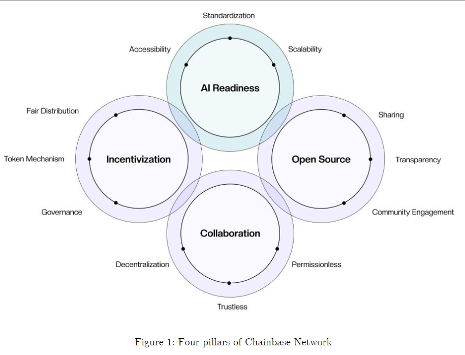

**1. 开源**
在数据驱动的时代，透明度和开放性对于促进创新和信任至关重要。开源软件为开发者提供了以突破性方式进行迭代、改进和创造的工具。随着人工智能革命的展开，那些向技术娴熟的社区公开分享其框架的项目和协议将引领未来。Chainbase 致力于开源关键开发成果，并培养一个积极参与的开发者社区。通过赋能贡献者构建和扩展其创新，Chainbase 确保了区块链技术在未来的持续增长、独创性和可访问性。
**2. 激励机制**
一个蓬勃发展的社区驱动型生态系统需要公平透明的激励模式，以奖励所有贡献者并促进创新。Chainbase 利用区块链技术细致地记录数据操作和贡献，为数据提供者、人工智能模型开发者和其他网络参与者提供清晰的归属信息。这种透明度确保了公平的补偿，并支持人工智能的道德发展。Chainbase 的架构积极激励整个网络的贡献，无论是通过保护去中心化基础设施、提供有价值的数据集、验证数据还是共享计算能力。$C 代币是该系统的核心，它实现了安全透明的经济流通，同时鼓励贡献者共享资源和专业知识，实现集体利益。
**3. 合作协作**
是Chainbase 数据驱动生态系统愿景的核心。通过消除对中心化权威的依赖，该网络营造了一个包容合作的环境，参与者可以共享集体知识并从中受益。Chainbase 认识到垄断方式无法满足不断发展的人工智能时代的需求。通过其无需许可的框架，该网络最大限度地发挥了跨角色的协作潜力，使参与者能够定义和分享针对新兴挑战和机遇的数据驱动洞察。
**4. AI**
就绪高质量、标准化的数据是人工智能发展的命脉。Chainbase 致力于为不同数据源建立统一的标准，确保数据卫生并与高级AI 应用程序兼容。该计划的核心是Manuscripts，它简化了数据格式和标准化，使其能够无缝地被AI 系统访问。Chainbase 旨在满足数据密集型AI 项目的需求，

**其核心堆栈包括**：
- Manuscript：用于构建数据资产的可编程层
- AVS（Autonomous Verifiable Service）层：**去中心化数据执行和验证**
- $C 代币：AGI 的原生货币

# 一、Chainbase网络
## 0. 架构和分层
图2：FourLayerStructureofChainbaseNetwork
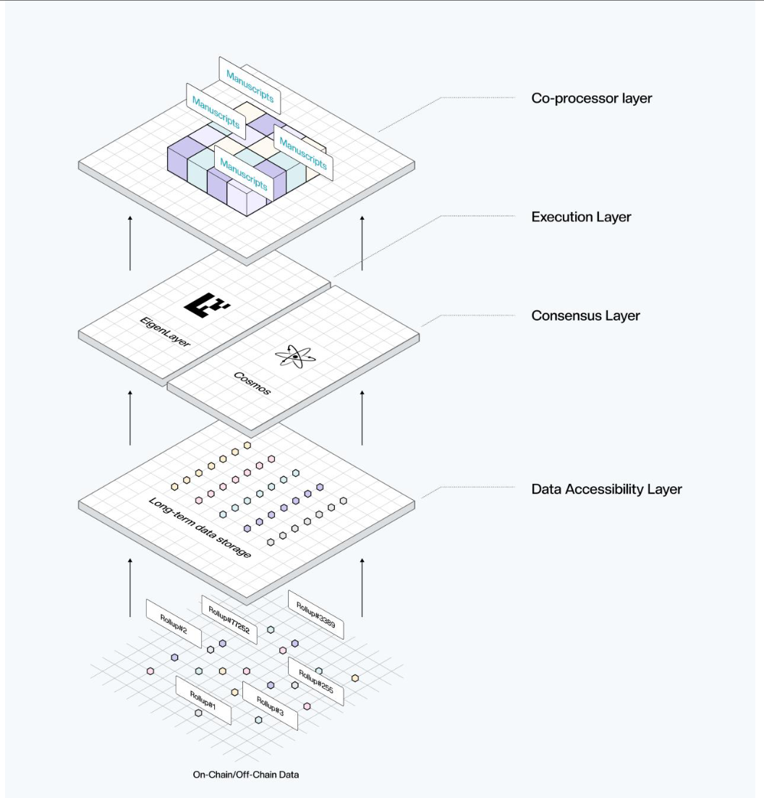
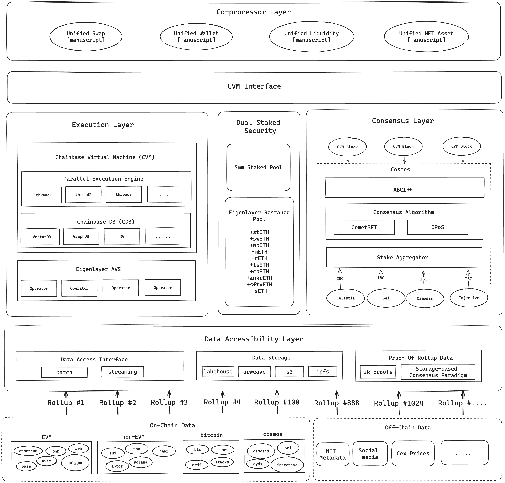

### Co-processor-layer
**旨在通过允许用户向网络贡献数据处理专业知识和AI 知识来促进协作。**
- 随着区块链技术的广泛应用，不同的应用场景会产生大量多样化的数据，如何从这些孤立且多样的数据中提取价值是一个极具挑战性的问题。
- 预设的数据集无法满足开发者的定制化需求。我们需要开放模块化、可组合的栈能力，充分释放开发者的创造力。这些创造力最终会转化为知识，因此我们需要一个Co-processor-layer。这将使大量开发者能够围绕 Chainbase 网络进行协作，积累知识，产生集体智慧。
- 该层的核心是“Manuscript”的概念，它是定义数据转换工作流的可编程脚本。
- Manuscript 是Chainbase 生态系统的重要组成部分，它是定义和执行数据处理任务的语言。它们允许开发人员标准化数据格式和处理任务，使原始数据可用于AI。
- 这一层还支持通过无缝集成来自各种区块链和链下来源的数据来实现互操作性。
- 此外，开发者可以通过将其工作转化为有价值的资产来实现知识货币化，而手稿在网络中被视为可交易的资源。
- $C 代币在此扮演着至关重要的角色，充当支付、结算、质押和治理的货币。
- co-processor-layer不仅促进协作知识共享，还建立了一个透明的经济体系，奖励参与者的宝贵贡献。通过实现专业知识的资产化并促进公平的报酬，该层推动了创新并提升了网络的整体效用。

**什么是Co-processor-layer？**
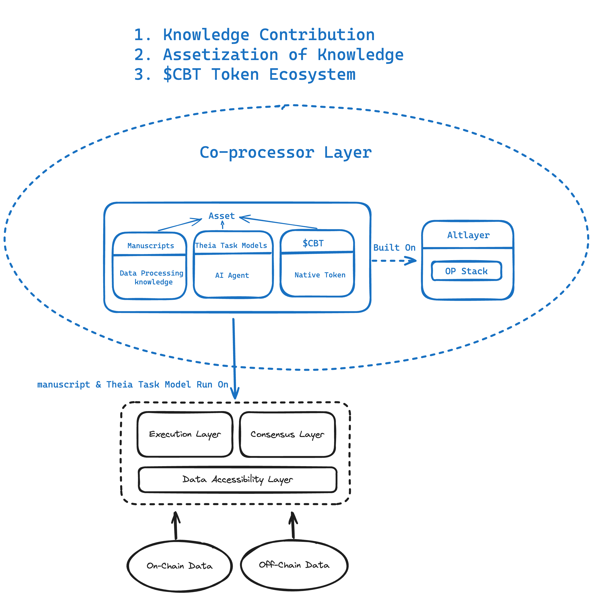
Chainbase 网络的Co-processor-layer是一个旨在促进用户协作，贡献数据处理和 AI 专家知识的组件。
其主要功能包括：
- **知识贡献**：用户可以将其在数据处理和专业任务模型方面的专业知识贡献给协处理器层。这种协作环境利用集体智慧来增强网络的功能。
- **知识资产化**：在协处理器层，贡献者将被转化为资产。协处理器层负责管理这些资产的分配、流通和交易，确保贡献者的知识和努力获得回报。
- **$C 代币生态系统**：协处理器层围绕 $C 代币构建，它是网络激励结构不可或缺的一部分。它促进支付、结算、质押和治理，从而创建一个充满活力的生态系统。

### double-chain-layer
Chainbase 引入了创新的双链架构，增强了跨链数据的可编程性和可组合性，支持高吞吐量、低延迟和最终确定性。该架构通过双重质押模型实现了更高的网络安全性。
图3：双链架构
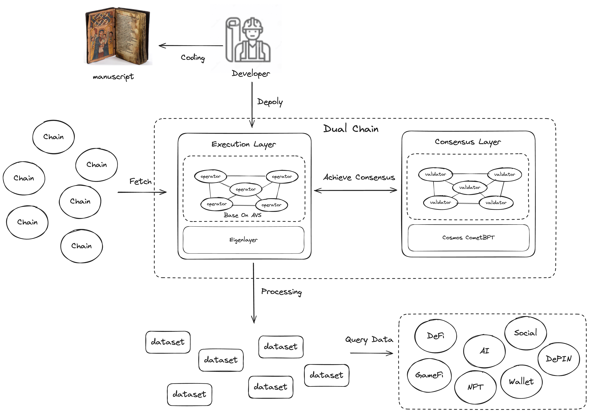

#### ①、excution-layer
**执行层充当Chainbase 的计算中心，负责执行Manuscript并管理大规模数据处理任务。**
- 其核心是Chainbase虚拟机(CVM)，这是一个针对处理手稿和执行数据工作流进行了优化的定制虚拟环境。
- 该层旨在通过采用数据并行和任务并行等高级处理技术来高效处理海量数据。
- 数据并行支持同时处理不同的数据集块，而任务并行允许并发执行多个任务，从而优化资源利用率。
- 执行层还集成了分布式验证协议，例如Eigenlayer，以增强去中心化和安全性。
- 节点运营商通过提供平稳运行所需的计算资源发挥着至关重要的作用，他们的贡献会根据工作量和性能获得奖励。
- 通过确保Manuscript的可扩展、高效和安全处理，执行层使开发人员能够执行复杂的AI 任务，同时保持高性能和可靠性。

**执行层擅长处理大规模数据和复杂的数据转换任务。**
**其主要优势包括：**
- **并行化**：通过数据并行和任务并行，执行层可以处理大规模数据，从而提高整体性能和吞吐量。
- **基于Eigenlayer AVS的去中心化环境**：Eigenlayer的引入不仅增强了系统的去中心化，还提供了额外的经济安全性，在执行层平衡了高性能和高安全性。
- **可编程运行环境**：执行层通过提供强大的计算逻辑执行环境，为开发人员提供了一个高效、灵活的平台，支持复杂的数据处理任务和应用场景。

### ②、consensus-layer
**共识层支撑着整个网络的安全性和完整性。**
共识层基于 CometBFT 的即时最终性，确保网络内所有节点就数据和状态的一致性达成共识，实现秒级数据新鲜度。它确保所有交易和数据状态都经过网络参与者的验证和同意,具体包括：
- 共识算法：基于CometBFT和DPoS（委托权益证明）实现高效、安全的共识。
- ABCI++： Cosmos 网络 ABI 的扩展，负责将 Chainbase 虚拟机（CVM）的状态转换为与 CometBFT 共识引擎兼容的格式。
- 权益聚合器：聚合来自各个 Cosmos 生态系统来源的权益代币，以确保网络安全。
- Chainbase **采用CometBFT 共识算法，这是一种拜占庭容错(BFT) 机制**，可确保抵御网络故障和恶意攻击的能力。
- 该算法提供即时最终性，确保数据近乎即时更新，并在整个网络中实现无缝更新。
- 共识层采用**委托权益证明(DPoS) 系统**，其中根据$C 代币质押选出的验证者维护区块链完整性、验证数据操作并确保一致性。
- 委托者通过将其$C 代币质押给受信任的验证者，进一步增强了网络安全性，从而增强了系统的经济韧性。
- 验证者因其在确保网络准确性和稳定性方面发挥的关键作用而获得奖励。通过将经济激励与网络安全相结合，共识层维护了一个强大且值得信赖的去中心化框架。

**共识层确保网络中所有节点之间的数据和状态一致性。**
**其主要优点包括：**
- **即时最终性**：使用 CometBFT，一旦数据被处理并包含在块中，它就被视为最终可见数据，而无需额外的确认或数据重组。
- **经过验证的稳健性**：CometBFT 经过实战检验，已成功保护了各种区块链网络中数十亿美元的资产，证明了其稳健性和可靠性。

**CometBFT 是什么?**
CometBFT 是一款用于在多台机器上安全一致地复制应用程序的软件。它确保在不到三分之一的机器发生故障时，系统仍能正常运行。CometBFT 的核心功能包括：
安全性：容忍任何类型的故障，包括恶意攻击。
一致性：所有正常运行的机器都可以看到相同的事务日志并计算相同的状态。
​
**CometBFT 的特点?**
拜占庭容错：CometBFT 可以容忍不到三分之一的机器故障，这些故障可以是任何形式，包括恶意攻击。
通用应用程序接口：通过应用程序区块链接口（ABCI），开发人员可以使用任何编程语言和开发环境来构建自己的应用程序逻辑。
高性能和易用性：CometBFT设计简单，性能高，适用于各种分布式应用。
模块化设计：将共识引擎与应用程序状态管理分离，提供灵活的开发环境。
​
**为什么选择 CometBFT 作为共识引擎??**
在Chainbase数据网络的分布式网络中，所有执行层节点需要对大规模数据处理的状态达成共识。共识的效率和韧性是关键因素，因此CometBFT是一个理想的选择。它确保系统在处理大量数据时能够高效且稳健地达成共识，提供强有力的支撑。

**CVM共识**
- 区块提议：验证者轮流提议新的区块。提议区块的验证者通过引擎 API 向 CVM 请求最新的区块。
- 区块构建：执行层CVM从数据访问层获取需要处理的源数据，运行提交到网络的Manuscript数据处理逻辑，生成Dataset记录和索引证明的结果，构建新的CVM区块。
- 区块包含：提议的 CVM 区块被打包为 CometBFT 交易并添加到共识层区块中，准备进行网络验证。
- 最终确定区块：如果提议的共识层区块获得验证者集三分之二的认可，该区块将被最终确定并添加到 Chainbase 数据网络链中。这些最终区块包含索引证明和 CVM 处理数据后的状态，最终共识区块代表这些处理后的数据可以被外部使用。

**如何集成 CVM 共识？**
图4： CVM 共识
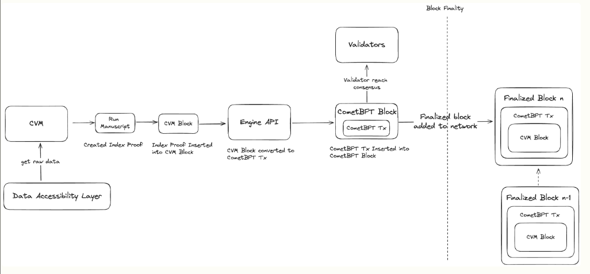

### data-Accessbility-layer
**数据可访问层构成了Chainbase 网络的数据基础。**
数据访问层负责管理网络中数据的访问和存储，**兼容流式和批式场景的数据访问接口**，并提供数据有效性验证。
它包括：
**数据访问接口**：提供对批量数据和流数据的访问。
**数据存储**：支持各种存储解决方案，包括 Lakehouse、Arweave、S3 和 IPFS。
**数据证明**：实施零知识证明和基于存储的共识范例，以确保数据完整性和可用性。

- 它负责收集、验证和存储链上和链下数据，以响应Manuscripts 的数据处理功能。
- 链上数据直接存储在区块链中，具有不可篡改、透明和安全的特性，非常适合记录交易历史记录、权益信息和元数据。
- 另一方面，链下数据则存储在去中心化存储系统中，以应对可扩展性和隐私方面的挑战。
- 链下数据的示例包括大型原始数据集、编程代码和复杂的AI 模型。
- 该层通过从去中心化的数据提供者网络获取信息来确保数据完整性，防止任何单一实体的控制或操纵。
- 它利用零知识证明(ZKP) 等先进的加密技术，在不暴露敏感信息的情况下验证数据源，同时通过共识机制确保数据在永久存储在去中心化系统之前的可信度。这种方法消除了数据碎片化，提供了对已验证信息的实时访问，并确保了为AI 应用提供高质量的数据。

**图5：数据流图**
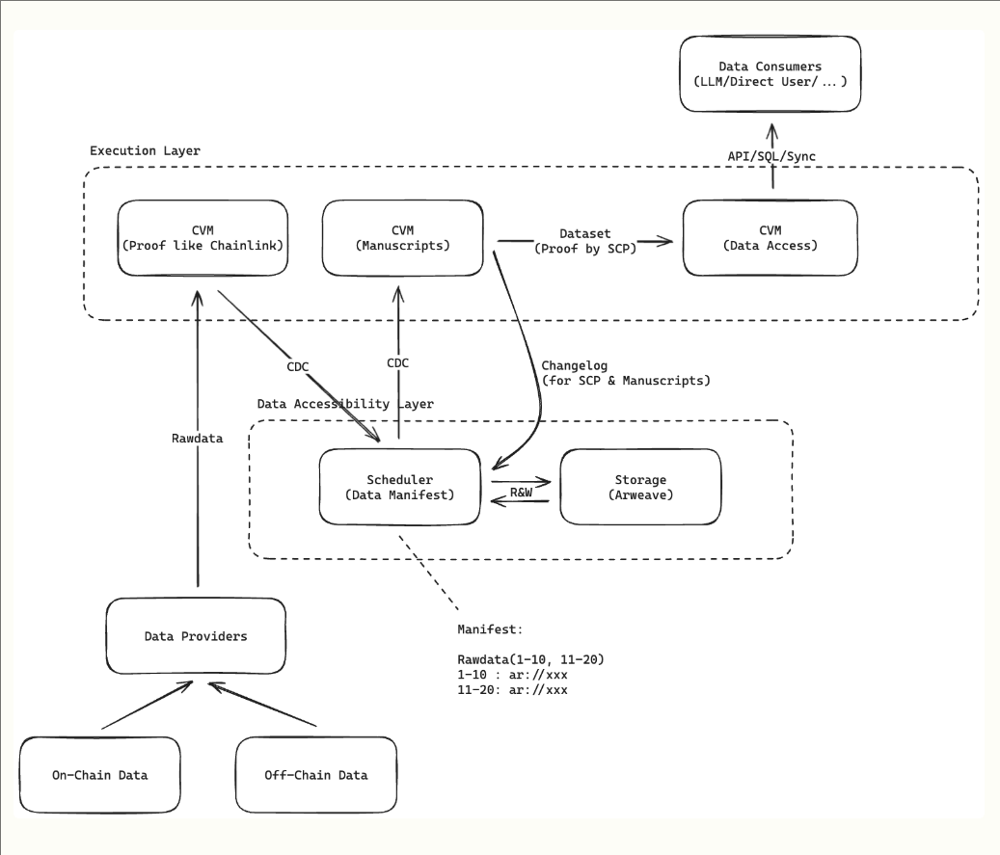
- 数据提供商收集链上和链下数据，然后将具有零知识证明的数据推送到 CVM。
- CVM 验证数据提供者提供的原始数据，并将数据以变更日志 (CDC) 的形式永久且不可篡改地写入 Arweave，同时更新 Manifest 中的数据索引。
该手稿使用 CDC 方法以流式方式使用原始数据来提取和处理高价值数据。
处理后的数据可直接存储到数据库或本地文件中，CVM通过SQL/API/Sync提供直接数据访问服务

**词汇表**
- **Data Providers**：提供链上或链下数据；
- **Data Consumers**：像 LLM/开发人员/数据工程师等消费者。
- **SCP**：基于存储的共识范式。这就是数据集的证明方式。
- **CDC（Changelog）**：变更数据捕获。数据永久存储在 Arweave 中，例如由 CDC 生成的变更日志。
- **Dataset**：存储在任何数据库或文件系统中的数据集。数据消费者可以通过 API / SQL / Sync 直接访问它。
- **Data Manifest**：数据清单是包含有关数据集信息的元数据文件。

**分布式数据湖**
原始数据以去中心化且不可变的方式存储在 Arweave 上。数据根据特定规则共享，并在分片后上传至 Arweave。数据分片通过 Manifest 进行维护，查询索引由 Scheduler 提供。
**图6.Manifest 的结构如下：**
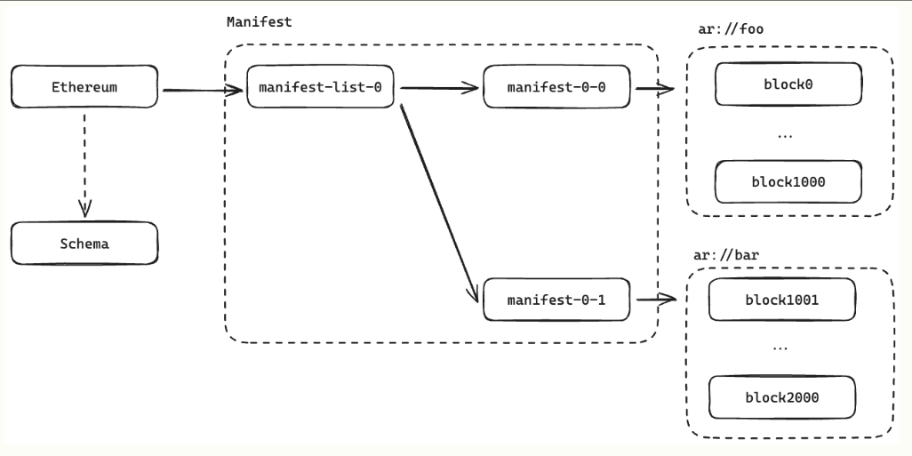

**图7.分片内的数据以Changelog的形式保存，Changelog的内容如下：**
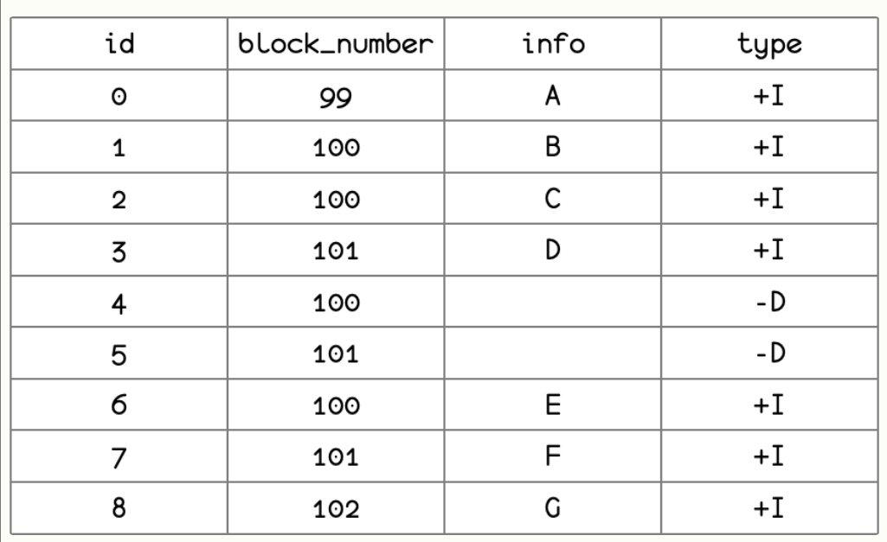
**以 Changelog 格式存储数据有以下优点：**
- 优雅地解决了区块链数据中的重组问题。
- 数据以仅追加的方式写入，无需处理冲突，从而实现最佳数据新鲜度。
- 下游的CVM可以以流式的方式不断读取上游的数据并进行处理，在受益于上游数据的复合效应的同时，下游数据也能保持良好的数据新鲜度。

**Proof of Raw Data**
**图8. 原始数据证明**
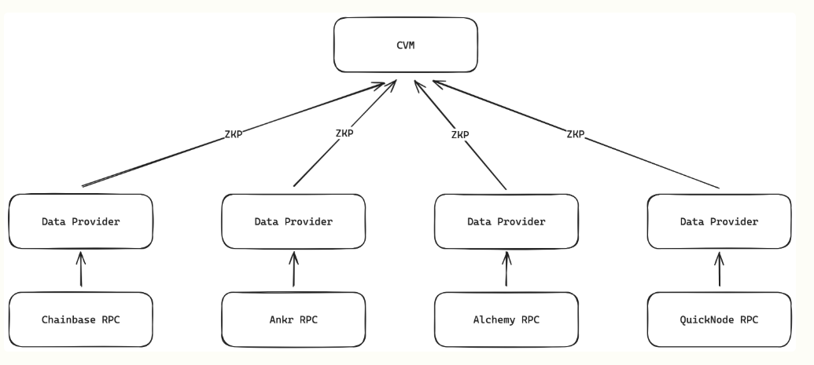
- Chainbase Network 采用**零知识证明（ZKP）技术**来证明数据的来源和完整性，任何网络用户都可以基于零知识证明来验证数据的来源和有效性。
- 网络的原始数据来自去中心化的数据提供者。这些数据提供者从不同的 Web3 RPC 服务节点获取数据，并使用共识算法确定最终的数据结果，从而防止任何单个数据提供者提供不正确或恶意的数据。
- Chainbase Network 还制定了 SLA（服务水平协议），要求数据提供商必须遵守 SLA 规定的数据质量和服务标准。如果数据提供商违反相应的 SLA，可能会面临处罚。

**索引数据证明**
使用 SCP（基于存储的共识范式）验证索引数据。
基本原则如下：
**图9. 索引数据证明**
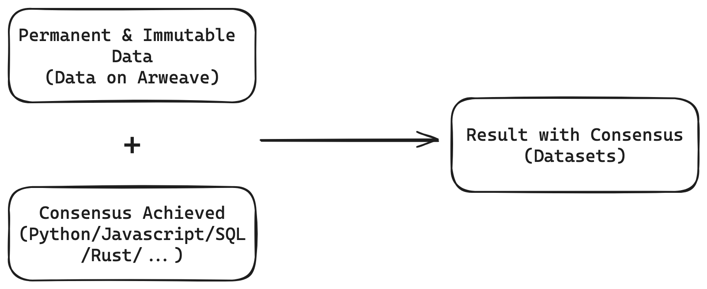
- 所有经过验证的原始数据都将永久存储在 Arweave 上，且不可篡改。
- Manuscript 是一个数据处理脚本，使用 Python、Javascript、Rust 和 SQL 等编程语言编写，这些语言是现实世界中已经达成的共识。
- 这些数据处理脚本将保持开源，允许任何验证者基于原始数据和 Manuscript 验证生成的索引数据，从而以简单有效的方式达成索引数据的共识。
______________________________________________________________

Chainbase 网络由**运营商Operators**、**消费者Consumers**、**验证者Validators**、**开发者Developers**和**委托人Delegators**组成，他们为网络提供服务，并向 Web3 应用程序提供数据。消费者使用这些应用程序并消费数据。

## 1.**开发人员**
### 开发人员
开发者**既是网络数据的需求方，也是供给**方。开发者**创作Manuscript**并发布到网络赚取奖励，同时，在构建Dapp时查询网络数据，成为网络的用户。

### 本地开发
开发人员使用chainbase-sdk在本地构建Manuscript。该 SDK 提供了一套全面的工具和库，可简化数据转换和查询的过程。

### 测试和验证
开发完成后，Manuscript可以部署到我们的沙盒环境中，开发人员有机会提前验证他们的Manuscript，以确保没有索引错误并且它们按预期工作。

### 发布
当开发者对其Manuscript件满意时，他们可以将其发布到网络上。这是一个链上操作，用于注册Manuscript，以便索引器（运营商）可以发现它。

## 2.**运营商**
运营商在网络中扮演着至关重要的角色，他们**为执行层提供必要的计算资源**，确保数据处理任务的顺利运行。运营商的奖励机制类似于工作量证明，工作量越大，硬件要求也就越高。

## 3.**验证者**
验证者在维护网络安全和共识方面发挥着关键作用。他们负责确保数据完整性并维护网络稳定性。网络中的验证者通过**改进的 CometBFT 达成共识**，并使用 **DPOS 机制**根据质押的 $C 数据大小确定投票权重。

## 4.**委托人**
委托人通过将自己的代币质押给验证者和运营者来增强网络的经济安全性。Chainbase 网络采用双重质押机制，委托人可以选择质押$ETH (or LST)或委托$C。

## 结论
Chainbase 凭借其创新的双链架构，成功整合了共识层和执行层的优势，实现了高性能、低延迟和最终确定性。该架构不仅增强了网络的可编程性和可组合性，还通过双重权益证明模型提供了更高的经济安全性。凭借即时交易最终确定性和久经考验的稳健性，Chainbase 为区块链性能和互操作性树立了新的标杆，为人工智能时代的数据处理和应用奠定了坚实的基础。

# 二、开发人员
## 1. 本地开发（即将推出）
开发人员使用chainbase-sdk在本地构建Manuscript。该 SDK 提供了一套全面的工具和库，可简化数据转换和查询的过程。

### 1.设置开发环境
首先，开发人员需要设置本地开发环境。这包括安装必要的依赖项、配置 SDK 以及设置本地区块链节点进行测试。
1）安装依赖项：确保已安装 Node.js 和 npm。然后，chainbase-sdk使用 npm 安装：
npm install chainbase-sdk
2）配置 SDK：创建一个配置文件来指定本地区块链节点的连接详细信息和其他设置。
3）设置本地节点：运行本地区块链节点来模拟网络环境。这允许您在受控的环境中测试您的Manuscript。
**？？？？？？？？？注意，官方提供的npm install chainbase-sdk 还无法安装，此处缺失运行节点的说明文档，因该是开发还没有完成，还没有上线**

### 2.测试和验证
开发完成后，Manuscript可以部署到我们的沙盒环境中，开发人员有机会提前验证他们的Manuscript，以确保没有索引错误并且它们按预期工作。

### 3.沙盒环境
沙盒环境模拟主网络，但独立运行，允许开发者在不影响现有网络的情况下测试他们的Manuscript。
该环境提供了调试和性能监控工具。
1）部署手稿：使用SDK将您的手稿部署到沙盒环境。
2）运行测试：执行一系列测试来验证手稿的功能和性能。
3）调试工具：利用提供的调试工具来识别和修复任何问题。

### 4.发布
当开发者对其Manuscript满意时，他们可以将其发布到网络上。
**这是一个链上操作**，用于注册Manuscript，以便**索引器（操作员）**可以发现它。

## 5.链上注册
发布Manuscript需要进行链上部署，将Manuscript注册到网络。此过程确保Manuscript被索引，并可供其他网络参与者查询。
- 准备Manuscript：确保您的Manuscript已定稿并经过彻底测试。
- 启动部署：使用 SDK 启动链上部署以发布您的Manuscript。
- 确认：等待区块链上确认部署。确认后，您的Manuscript将正式发布并被索引。

## 6.赚取奖励
通过发布Manuscript，开发者可以根据其数据转换的使用情况和价值获得奖励。
该网络激励高质量且频繁使用的Manuscript，为活跃的开发者提供源源不断的奖励。
基于使用情况的奖励：根据您的Manuscript的查询次数和处理的数据量获得奖励。
质量激励：提供有价值数据转换的高质量Manuscript有资格获得额外激励。

# 三、运营商
运营商在网络中扮演着至关重要的角色，他们为执行层提供必要的计算资源，确保数据处理任务的顺利运行。
**运营商的奖励方式类似于工作量证明**，工作量越大，对硬件的要求也就越高。

## 1.成为运营商
要成为 Chainbase 网络中的运营商，请按照以下步骤操作：
1）**注册**：在 Holesky 测试网或 Eigenlayer 智能合约的主网上注册成为运营商。这将把你的以太坊公钥注册到 Eigenlayer 智能合约中。请按照Eigenlayer上的说明操作。
2）**设置基础设施**：确保您拥有必要的硬件和软件基础设施来支持网络的计算要求。
3）**运行节点软件**：安装并运行Chainbase节点软件即可开始参与网络。

## 2.职责
运营商负责维护和管理数据处理任务所需的计算基础设施。
1）基础设施管理：维护和管理硬件和软件基础设施，以确保高效运行。
2）数据处理：处理并执行数据开发者提交的数据查询请求。

## 3.奖励
运营者根据其提供的数据处理服务的质量和数量获得奖励。
网络激励运营者维护和优化其计算资源。

# 四、验证者
## 1.成为验证者
要成为 Chainbase 网络中的验证者，请按照以下步骤操作：
1）联系团队：联系 Chainbase 团队，表达您成为验证者的兴趣并获取详细说明。
2）满足要求：确保您满足运行验证器节点所需的硬件和软件要求。
3）注册：按照提供的说明在网络上注册为验证者。
4）设置节点：安装并配置验证器节点软件以开始参与网络。

## 2.职责
验证者负责验证交易、维护网络共识并确保数据完整性。
1）交易验证：验证并确认交易，以确保其合法性和准确性。
2）共识维护：维护网络的共识机制，防止恶意行为和攻击。
3）数据完整性：确保在网络上处理和存储的数据的完整性。
4）网络治理：通过对网络改进和发展方向提出和投票来参与网络治理。

## 3.奖励
验证者因其在维护网络安全和稳定方面所做出的贡献而获得奖励。奖励结构激励验证者有效地履行职责。

## 4.监控和性能
验证者应持续监控其节点的性能，以确保其符合网络的标准。
1）性能指标：访问性能指标来评估节点的效率和可靠性。
2）定期监控：定期检查节点的状态和性能，以确保其以最佳状态运行。
3）升级和维护：执行必要的升级和维护，以确保您的节点保持最新和安全。

# 五、委托人
## 1.质押代币
委托人可以质押他们的代币来支持验证者和运营商，为网络的安全性和稳定性做出贡献。
1）选择代币：决定是否进行质押$ETH (or $LST)或$C。
2）选择验证器/运营商：选择您想要支持的验证器和运营商。
3）质押代币：使用质押界面将您的代币委托给选定的验证者和运营商。

## 2.奖励
通过质押代币，委托人可以获得他们支持的验证者和运营商所获得的奖励份额。

# 六、代币经济学
https://docs.chainbase.com/introduction/tokenomics

## 1.人工智能时代，需要新的数据经济
- 数据是人工智能的基础。
- 随着人工智能变得更加自主并深入嵌入数字基础设施，**高质量数据已成为最宝贵的资产**。
- 然而，当前的数据系统并非为智能机器构建。
- 区块链数据仍然碎片化、非结构化、不可验证，并且缺乏定价或激励模型。
- 目前缺乏有效的数据估值、交易或协调机制。

Chainbase 引入了一项新标准：超数据网络 (Hyperdata Network)。
该网络专为 AI 原生互联网而设计，将原始区块链活动转换为结构化、可组合且机器可消费的数据。
它使自主代理、协议和人类能够通过共享数据层进行访问和协调。
这个生态系统的核心是$C。它为人工智能和更广泛的 DataFi 经济提供动力。

## 2.$C 代币
 $C 是 DataFi 生态系统的基础资产，支持跨人工智能和加密的结构化数据的生产、交换和治理。

### $C 的核心实用程序
- **数据集访问**
代理、应用程序和协议使用 $C 来查询和使用结构化数据。​

- **生态系统激励措施**
根据开发人员、贡献者和用户的活动和对网络的价值分发给他们。
​
- **去中心化执行安全**
通过 AVS 层支持和验证数据处理。
​
- **协议治理**
代币持有者对协议升级、激励模型和网络参数进行投票。
​
- **DataFi 货币**
作为整个 Chainbase 生态系统的标准记账单位和结算单位。

## 3.代币分配
Chainbase 已将 $C 总供应量的 65% 用于生态系统发展、贡献者奖励和用户激励。
这体现了 Chainbase 对开放参与和长期合作的承诺。

### 代币分配明细
- 生态系统 + 社区 (40%)：预留用于拨款、集成、开发者激励、活动奖励以及长期社区发展。此项分配支持 Chainbase 网络的开放访问和持续参与。
- 空投奖励（13%）：分三季发放，用于奖励战略合作伙伴（例如：第一季分配3.5%，包括2%的原生社区奖励和额外的1.5%的Binance Alpha）、开发者、用户、项目团队以及积极支持生态系统发展的贡献者。
- 工人激励（12%）：分配给操作数据节点并支持 Chainbase 去中心化基础设施的参与者。
- 早期支持者（17%）：为项目提供早期支持和指导的初始投资者。
- 核心贡献者（15%）：奖励创始团队成员和核心建设者，分配与长期协议成功最佳一致。
- 流动性（3%）：为交易所支持和健康的市场动态而保留。
- **总供应量**：1,000,000,000 $C
- **初始解锁供应量**：16%

### 解锁时间表
 $C 发行模型的结构旨在确保长期稳定性和有意义的参与。

### 核心团队和早期支持者
代币在 3 年内归属，其中 12 个月为锁仓期，随后 24 个月为线性分配，旨在激励长期贡献。

### 持续激励基础设施运营商
工人激励机制分配给操作数据节点的参与者，在 60 个月内线性归属，确保为 Chainbase 网络提供去中心化基础设施的持续支持。

### 生态系统相关
- 分配给生态系统发展的代币将在 36 个月内线性解锁，与开发人员的增长、激励计划和平台采用里程碑保持一致。
- 这种分阶段推出的模式使得 $C 供应量能够与实际使用量同步扩大，减轻短期投机压力，并加强对 DataFi 经济的可持续参与。

### 在 Base 和 BNB Chain 上线
 $C 将主要在 **Base 上线**，并在 BNB 智能链 (BSC) 上提供额外的流动性。这种双链模式使 Chainbase 生态系统能够：
- 利用 Base 的性能、低费用和强大的开发者生态系统；
- 通过 BSC 提供更广泛的流动性和用户群；
- 跨链效用和交易；
这种方法可确保顺利启动，并使 Chainbase 能够在 Web3 生态系统中实现长期互操作性。

### 为什么$C很重要
- 数据不再是被动的基础设施，而是资本。
- $C 将原始数据转化为经济资产。它促进自主协调，奖励真正的贡献，并实现开放的、人工智能就绪的数据经济。
- Chainbase 提供基础设施。
- $C 通过使基础设施流动起来、可扩展且人人可用来实现这一目标。

# 七、 治理
Chainbase  Network 因其精心构建的治理生态系统而脱颖而出，该生态系统将去中心化原则与社区参与的实用机制相结合。
从本质上讲，这种治理模式反映了Chainbase 网络致力于承认社区的贡献并确保整体可持续发展的承诺。
## 7.1 Chainbase  DAO
Chainbase DAO 代表了治理框架的去中心化。
- 这种DAO 结构允许社区成员直接或通过民选代表积极参与决策，确保贡献者的包容性代表性。
- 与简单的投票系统不同，Chainbase DAO 旨在支持战略资源配置，平衡当前发展需求和长期网络目标。
- 它还可以作为创新的催化剂，激励参与者做出有意义的贡献，并确保网络保持活力和前瞻性。
## 7.2Chainbase 基金会
Chainbase 基金会在支持网络的增长和稳定方面发挥着至关重要的作用，尤其是在其早期阶段。
**其主要重点是：**
- 构建和改进网络的基础设施，连接关键利益相关者，并推动创新。
- 通过提供指导和资源，基金会确保网络拥有成功所需的工具。
- 基金会领导的一项重要计划是Manuscript 开发，这是一项旨在加强Chainbase  Network 核心技术的开源工作。
- 基金会优先考虑可扩展性、安全性和去中心化等关键领域的研究，确保基础设施保持有效并随时准备应对潜在挑战。
## 7.3双轨治理方法
通过这种双轨制运营——DAO 推动社区驱动的决策，基金会锚定发展重点——Chainbase 实现了独特的平衡。DAO 确保社区自治，让参与者在治理中拥有发言权和股份，而基金会则在关键增长阶段提供清晰的目标和高效的资源分配。重要的是，基金会被设计为一个临时实体，其最终目标是培育一个可以完全自主运作的生态系统。这种转变反映了Chainbase  Network 对真正去中心化的承诺，确保生态系统发展成为一个自我维持和社区驱动的实体。

# 八、双重质押
## 1.为什么要双重质押？
- 早期的 PoS（权益证明）网络可能面临“**死亡螺旋**”问题。如果代币价值下跌，网络的安全性就会被削弱，导致**总锁定价值（TVL）**下降，进而进一步压低代币价格，最终形成死亡螺旋。
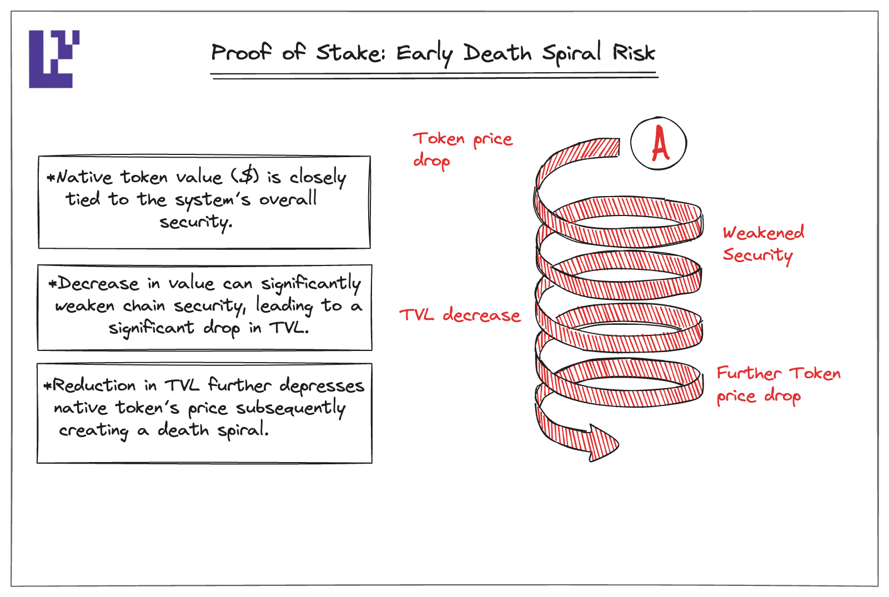

## 2.工作原理
使用两种代币保护同一个 PoS 网络，其中一种可以是低波动性、高流动性、更易于访问的外部网络代币，例如以太坊 (ETH)。同时使用网络原生代币来获取网络价值。
​
### 3.不同的方法
- 模块化双重质押：本地运营商和 ETH 支持的运营商分别需要达到法定人数。
- 原生双重权益：与网状安全类似，两组操作员被视为一组，每个操作员的权益基于外部预言机转换为统一单位，然后用户根据合并的法定人数验证响应。
- 否决双重质押：本地运营者首先获得单独投票权，ETH 支持的运营者则作为保障，监督本地运营者的行为。如果本地运营者犯错，ETH 支持的运营者有权否决其发送的有效回复。

### 4.Impl 架构
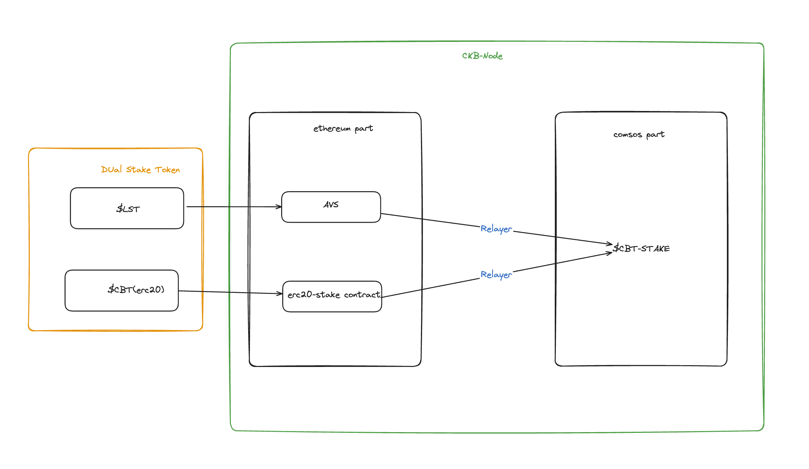

# 九、展望未来
展望未来Chainbase 旨在彻底改变人工智能与区块链的交汇点，使参与者能够在去中心化、知识驱动的生态系统中创造、协作和创新。Manuscript 框架支持标准化工作流程，将原始区块链数据转换为精选数据集，从而促进精准高效的人工智能训练。这些数据集以及数据处理标准和算法的动态市场降低了人工智能应用的障碍，使开发人员能够将他们的专业知识货币化，并获得用于欺诈检测或市场预测等任务的预构建解决方案。通过利用由$C 代币激励的节点运营商分散网络，Chainbase 使AI 训练和执行民主化，确保小型组织和个人开发者的包容性和可访问性。
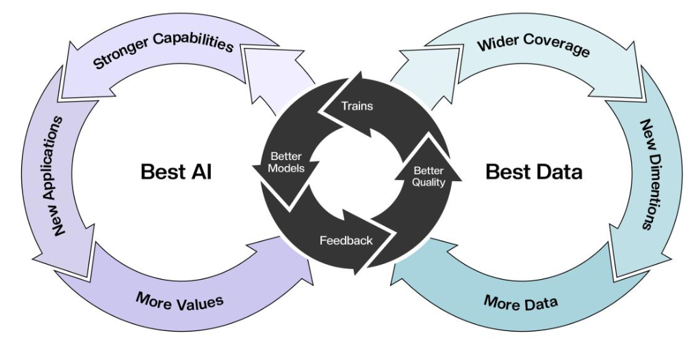
**图6：飞轮：最好的数据，最好的人工智能**
- Chainbase 内的区块链集成确保了安全透明的人工智能开发，解决了有关数据来源、算法完整性和偏见的关键问题。
- $C 代币支撑着知识型经济，激励数据提供者、开发者和参与者不断贡献和创新。
- 这个生态系统弥合了AI和Web3之间的差距，使开发人员能够使用智能自动化和预测分析等高级功能增强去中心化应用程序。
- 通过结合标准化数据管道、去中心化计算、成熟的共识机制和透明的AI实践，Chainbase有望成为AI和区块链融合的变革力量，为下一波智能和去中心化解决方案赋能。

# 十、Manuscript 
**Manuscript 是一个革命性的区块链数据流框架**。通过 Manuscript，您可以将链上和链下数据无缝集成到目标数据存储中，进行不受限制的查询和分析。

## 1.Manuscript的愿景

Manuscript 的愿景是实现 Chainbase 网络内的“数据交易”，建立一个 Chainbase 生态组件，让用户能够通过任何方式、任何服务、任何语言访问任何数据。这个宏伟愿景可以分解为以下几个关键方面：
- **任意语言**：我们希望用户可以使用任意主流编程语言的脚本来定制数据，包括但不限于：Golang、Rust、Python、Node.js、Java、C/C++、Zig、WebAssembly（WASM）
- **任意方式**：不同的用户熟悉不同的数据访问方式，我们希望用户可以通过多种方式访问数据，包括但不限于：SQL、DataFrames、HTTPS、gRPC、FTP、WebDAV、FUSE
- **任何数据**：用户应该能够访问任何格式的数据，例如：JSON、CSV、ORC、XML、XLSX、BLOB
- **跨任意服务**：用户期望的数据存储服务也各不相同，我们希望用户可以在任何服务中访问、传输和控制数据，例如：RPC、S3、IPFS、Azblob、HDFS、Google Drive、BigQuery、WebDAV、MySQL、PostgreSQL

在 Chainbase 生态系统中，链上数据可以被标记、分类和处理，将复杂的数据转化为易于理解和使用的形式。人工智能算法可以自动分析海量区块链数据，发现隐藏的模式、趋势和异常，帮助用户从数据中获得洞察。
Manuscript 为这一过程提供了丰富的工具和资源，使数据处理更加高效透明。通过这些技术手段，Manuscript 不仅使链上数据的访问更加自由灵活，也极大地提升了数据的价值，让更多人能够轻松地使用和应用这些链上数据。

## 2.Manuscript价值
- **可编程性**：Manuscript 提供强大的可编程接口，允许开发者根据自身需求定制数据处理工作流程。这种灵活性意味着 Manuscript 不仅可以用于简单的数据查询，还可以用于构建复杂的数据分析流程和应用程序。Manuscript 的可编程性为区块链数据的创新应用开辟了无限可能。
- **互操作性**：随着区块链技术的蓬勃发展，不同区块链之间理解和处理彼此数据的难度日益加大。Manuscript 可以解决多链及链下数据聚合在任意维度上的互操作性问题。通过提供统一的接口和数据处理方法，Manuscript 实现了不同区块链数据的无缝集成，大大提升了跨链应用的开发效率和可行性。
- **变现**：Chainbase 依托 Manuscript 提供的数据能力，结合 CometBFT + DPoS 双链架构、高性能即时交易最终确定性和权益证明共识机制，构建了一个公平透明的数据价值交换生态。数据创造者可以通过 Manuscript 将处理后的数据变现，数据使用者也可以便捷地消费所需的数据。这种机制不仅激励了高质量数据的产出，也促进了整个区块链生态的良性发展。

## 3.Manuscript设计
Manuscript 作为 Chainbase 网络中的数据访问层(DA???)，需要对接大量现有的数据协议。
其核心设计理念围绕模块化和可扩展性，由以下关键组件构成：

- **Accessor (Data Source)**:
作为最底层的接口，所有服务都需要实现该接口，负责将上层调用转换为下层请求
例如，将读取请求转换为相应的服务 API 调用
提供统一的数据访问抽象，屏蔽底层存储和服务的差异

- **Processor (Data Method)**:
面向用户的高级方法，允许他们方便地创建读写请求
提供SQL语法、初始化数据集等操作。
封装复杂的数据互操作底层逻辑，提供简洁的用户界面

- **Handler (Data Target)**:
处理具体的读写请求，管理数据对象的生命周期，实现数据的序列化和反序列化
处理数据一致性和并发问题
例如，将用户处理的数据写入本地关系数据库，如MySQL，PostgreSQL等。

- **Signer (Proof of Stake)**:
允许用户预生成签名URL，支持临时授权访问，增强数据访问的安全性
基于智能合约实现权限管理和权益分配证明接口

## 4.Manuscript-gui的使用
目前我的测试环境是linux，没有现成的编译好的应用可用，需要手动编译，如何编译，请教AI
https://github.com/chainbase-labs/manuscript-core/
**注意，mac可能有现成编译好的应用，可以直接下载安装使用。2025年8月4日。**

程序打开以后，可以按照官方的说明进行debug操作：我按照官方的说明操作成功了，可以拿到数据，所以这里不再赘述。
https://docs.chainbase.com/core-concepts/manuscript/QuickStart/create_manuscript

这里说一下部署的事情：

# 十一、Manuscript高级功能
##  1.概述
Chainbase Network 中的数据集就像是未提炼的初级矿物，**炼金术士（开发者）**可以使用 Manuscripts 来处理这些数据，从现有的数据中提取更大的价值。
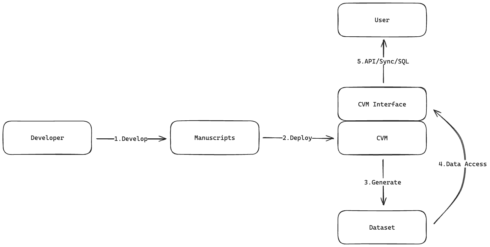

## 2.协议
Chainbase Network 致力于让数据（链上和链下）更易于访问，因此 Manuscripts **允许用户和开发人员使用 SQL**查询和处理数据。

### Manuscripts的组成
- Schema：数据集的定义。
- Operators：提取、转换、加载方法，用于从现有数据中提取更大的价值。
下面这个图就是我在本地linux环境中测试的

其中ethereum.blocks是chainbase网络中已经存在的数据集，可以通过NETWORK页面，查看该数据集的相关信息。
从官网文档的描述来看，开发人员可以创建架构，定义数据集，然后使用Manuscripts，编写sql来处理数据。
开发人员需要定义结果表的模式，包括字段名称、字段类型和字段描述。

### 通用许可证
对于经验丰富的炼金术士来说，可以使用通用编程语言 (GPL)，例如 Python 或 JavaScript，来提取和处理数据。GPL 将提供最灵活、最强大的数据提取功能。
**即将推出… （当前文档事件：2025年8月6日）**

# 十二、Chainbase Zone
## 1.概述
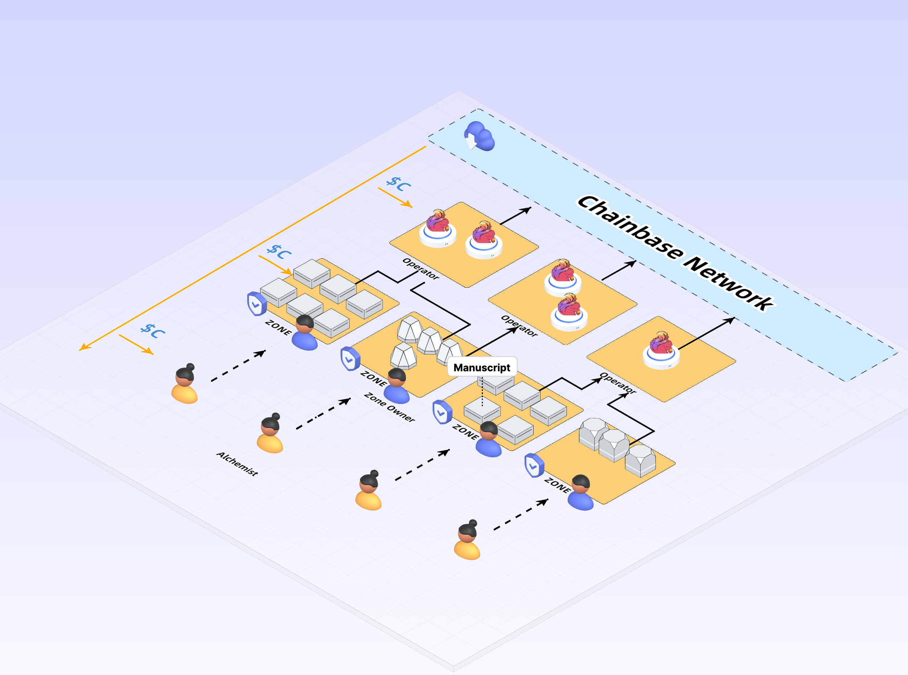
- Chainbase Zone 是 Manuscript 框架内一个专门的数据处理域，专注于解析和分析特定行业或用例的区块链数据。
- Zone 是 Manuscript 实现的集合，它们协同工作，为特定的区块链领域提供全面的数据解决方案。

## 2.Chainbase 中的Zone提供了几个关键功能：
1. **数据专业化**：专注于特定的区块链领域（DeFi、NFT、游戏等）；
2. **自定义处理**：为您的域定义专门的数据处理工作流程；
3. **互操作性**：连接多种数据源和输出格式；
4. **货币化**：通过向网络提供有价值的处理数据来获得奖励；

## 3.区域角色和工作流程
Chainbase Zone生态系统由多个关键角色组成，它们共同努力确保高效、高质量的数据处理。

**1）核心角色**
(1). Zone Owner
- 负责创建和管理特定领域的数据处理场景
- 定义区域的业务范围和技术规范
- 审查并更新区域内的稿件
- 管理区域的经济模型和奖励机制

(2). Alchemist/ˈælkəmɪst/炼金术士（开发者）
- 根据区域规范制定手稿
- 实现并优化数据处理逻辑
- 提供技术支持和维护
- 参与区域技术升级讨论

(3). 运营商
- 选择并运行特定区域
- 提供计算资源和基础设施支持
- 确保区域内所有稿件稳定运行
- 监控系统性能并处理异常

**2） 工作流程**
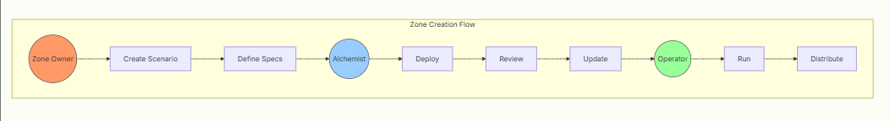

## 4. 创建 Chainbase Zone
**1）部署区域的推荐流程**
在主网上部署您的第一个区域之前，我们**强烈建议遵循以下顺序**：
1. 本地开发：使用示例数据处理工作流程在本地创建和测试您的区域
2. 测试网部署：在 Chainbase 测试网上部署您的区域以验证您的数据处理管道
3. 主网启动：经过全面测试后，在 Chainbase 主网上部署您的区域

**2）先决条件**
要创建区域，请确保您具有：
- 安装 Chainbase Manuscript 框架；
- 创建了 emv 钱包；

3）创建本地Zone
**步骤 1**. 设置本地开发环境
**注意：这个方法就是我前面说的自己编译的方法，还需要配套本地的编译环境，可以咨询AI自行安装。** ####Install Manuscript core dependencies####
git clone https://github.com/chainbase-labs/manuscript-core
cd manuscript-core
make install gui # or cli

**步骤2**. 配置区域（**即将推出.. 当前是2025年8月6日笔记**）
Ⅰ. **区域生命周期管理**
**性能监控**
区域评估基于以下标准：
(1). 数据处理吞吐量
(2). 查询响应时间
(3). 错误处理数据准确性和完整性
(4). 网络利用率
​
**注销注册**
如果出现以下情况，绩效不佳的区域可能会被取消注册：
(1).持续未能达到绩效指标
(2).处理无效或损坏的数据
(3).违反网络政策
​
Ⅱ.**最佳实践**
(1). **测试**：在主网部署之前彻底测试区域的数据处理管道
(2). **文档**：维护区域功能和用途的清晰文档
(3). **监控**：对区域性能实施强有力的监控
(4). **更新**：定期更新区域的组件以保持兼容性和安全性
​
Ⅲ. **社区贡献**
Chainbase Zones 的成功取决于社区的参与。贡献者可以：
(1).为不同的区块链领域开发新的专业区
(2).改进现有区域实施
(3).分享区域模板和最佳实践
(4).参与区域治理决策

**有关为 Chainbase 生态系统做出贡献的更多信息，请访问我们的社区指南。https://docs.chainbase.com/contributing/overview**

测试脚本配置：
name: demo
specVersion: vl.0.0
parallelism:1

sources:
  - name: ethereum_blocks
    type: dataset
    dataset:ethereum.blocks

transforms:
  - name: ethereum_ethereum_blocks_transform
    sql: >
      Select * From ethereum_blocks limit 100

sinks:
  - name: ethereum_ethereum_blocks_sink
    type: postgres
    from: ethereum_ethereum_blocks_transform
    database: zhf_db
    schema: zhf
    table: blocks
    primary_key: block_number
    config:
      host: 127.0.0.1
      port:5432
      username: zhf
      password: 123123

#  十三、基于AVS的数据处理
## 1. 概述
Chainbase Network 是一个基于 Cosmos 和 EigenLayer双链架构的超数据网络，旨在实现可信透明的链上数据处理。
- 通过Chainbase 虚拟机 (CVM) 上的Manuscript 协议，该网络确保了无缝的数据互操作性。
- 通过集成EigenLayer 的Staking 机制，Chainbase 利用以太坊的经济安全性为其执行层构建了高性能的 AVS执行层。
- 这确保了大规模数据处理能力的同时，也保持了安全性、去中心化和可扩展性，从而满足了区块链应用日益增长的需求。

## 2. 基于AVS的执行层节点
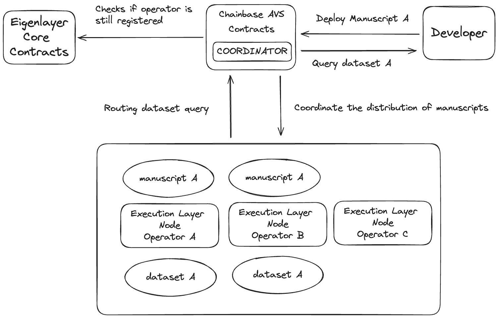
Chainbase Network 的执行层节点构建于 EigenLayer 之上，为用户提供链上数据处理的节点网络。
- 开发者可以提交手稿数据处理程序并请求最终结果数据集。拥有计算资源的 EigenLayer 运营者可以重新抵押并注册成为 Chainbase Network 的执行层节点，提供所需的计算资源。
- 由于 Chainbase Network 集成了数据查询手续费，重新抵押者将从中获得收益。
- 随着越来越多的 Manuscripts 在 Chainbase Network 上运行，需要更多高质量的计算资源。
- 为了在保持高吞吐量的同时实现资源的弹性伸缩，需要根据 Manuscript 的运行偏好将链上计算任务路由到最佳提供商。
- - 关键因素包括节点地理位置（延迟）、计算硬件和网络环境。EigenLayer 将通过多样化的算子和路由策略支持 Chainbase Network，以满足这些需求。

# 十四、 Chainbase 网络 AVS 设计
## 1. 概述
EigenLayer 的 AVS 是其高性能执行层的基石。

## 2. 与 EigenLayer Core 集成（AVS Directory）
为了与 EigenLayer Core 集成，Chainbase Network 实现了 ECDSAServiceManagerBase 或 ServiceManagerBase (BLS) 的实例。此集成允许操作员通过向 AvsServiceManager 发送交易来进行注册，从而完成注册过程。
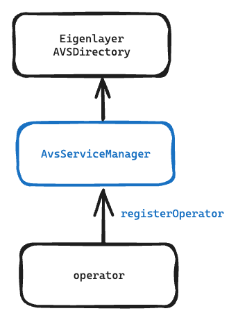

## 3. 链上验证挑战
Chainbase Network 需要一群稳定高效的运营者来构建一个去中心化且值得信赖的数据处理网络。协调器组件需要一种机制来衡量这些运营者的运营质量，确保他们符合网络的标准。这可以通过链上共识机制来实现，违规者将被罚没。
协调器定期生成挑战任务，该任务涉及计算 Chainbase Network 集成的区块链数据中特定区块的哈希值。该任务有明确的答案和预期结果。挑战会被发送到操作员的脚本节点，操作员在脚本节点执行任务并返回签名结果以及记录的任务执行时间。这些信息用于评估操作员的效率，并在 AVS 链上验证结果。
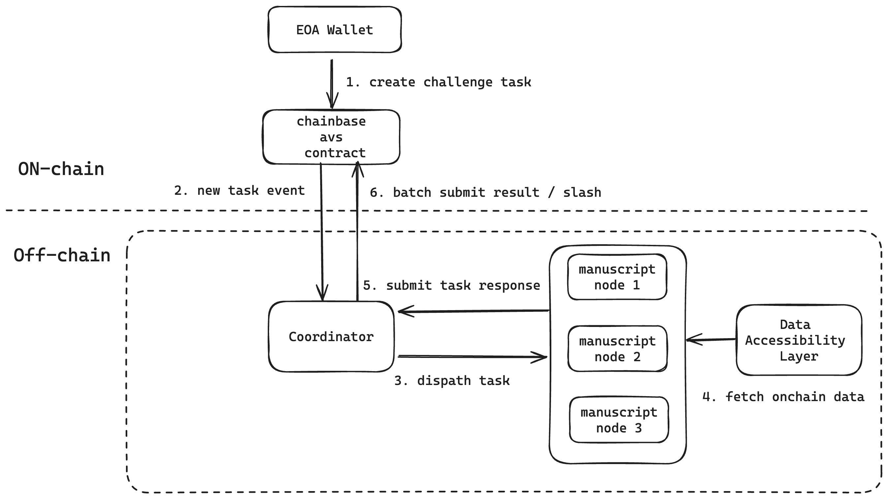

## 4. 实现细节
- **Coordinator：**
a、监听链上合约ChainbaseServiceManager事件。
b、Manuscript Node通过 RPC 接口发送任务。
c、Manuscript Node通过 RPC 接口接收任务响应。
d、汇总来自多个的响应Manuscript Nodes并将结果提交给链上合约ChainbaseServiceManager。

- **Manuscript Node：**
a、通过调用注册coordinator,来注册该运营商。
b、通过 RPC 接口从 Coordinator 接收任务。
c、执行任务，签署任务响应。
d、将签名的任务响应发送回coordinator。

- **Contracts：**
“ChainbaseServiceManager”合约包含了“createNewTask”和“respondToTask”这两个函数，它们有助于任务的创建以及任务响应的提交，从而便于进行验证。

# 十六、业务逻辑图
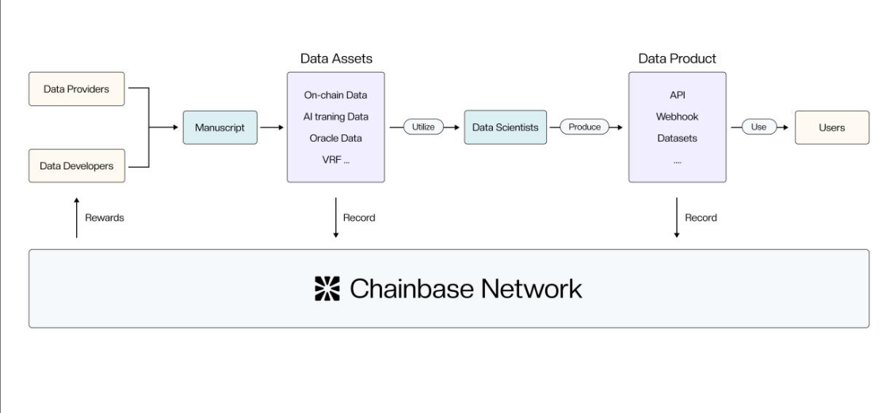

# 十七、词汇表
⚗️炼金术士**Alchemist** ----
创建、操纵或修改手稿的开发人员或技术贡献者。
📜 **Manuscript** ---- 在 Chainbase 虚拟机 (CVM) 上运行的可执行文件。Manuscript 定义了不同数据源在转换为数据集时需要遵循的标准模式。
⚙️ Chainbase 虚拟机 **CVM** ---- 
一个虚拟执行环境，具有完整的接口，可以执行复杂的数据查询。
💾数据集 **Data Set** ---- 
由数据表组成并存储在 Chainbase 仓库中的聚合、验证和索引数据的结构化集合。
🏭**Chainbase Warehouse** ----
数据平台上所有预建数据集的存储库。
💽数据网络**Data Network**---- 
CVM/Eigenlayer AVS（执行）、IBC、ABCI++ 和 CometBFT（共识）的交集，以及由汇总/网络参与者组成的专有数据可用性层。
💿数据平台**Data Platform**---- 
一套开发人员工具，允许简化对数据网络上可用信息的访问。
🤖 **TheiaChat** ---- 
基于 Theia 的人工智能代理，通过内置知识库提供简化的数据网络接入点。
🗺️ Theia/ˈθaɪə/----
专有的加密世界模型，它使用加密模式的因果推理来创建加密数据的可验证推理链。

# 十八