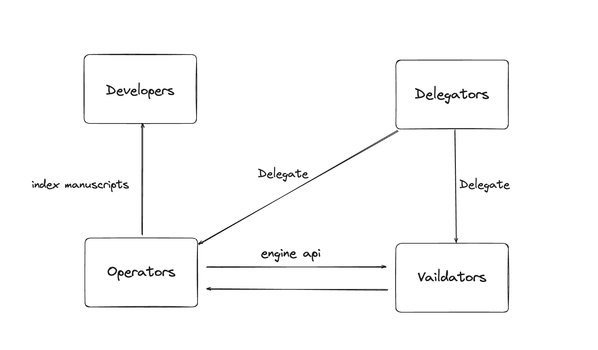
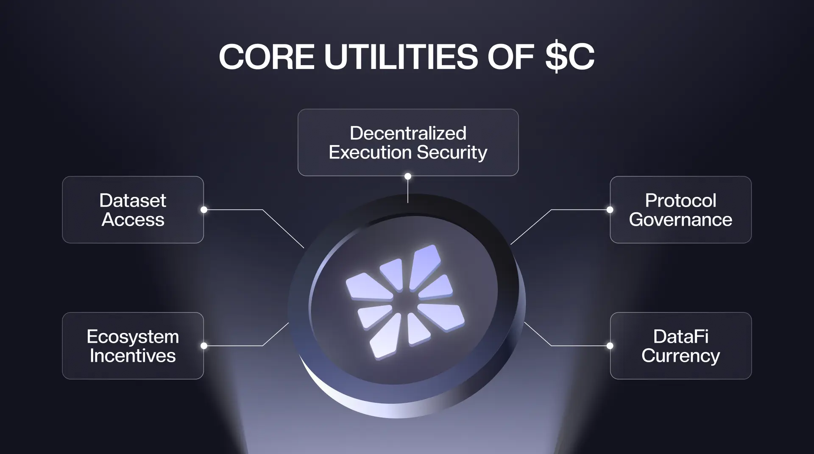
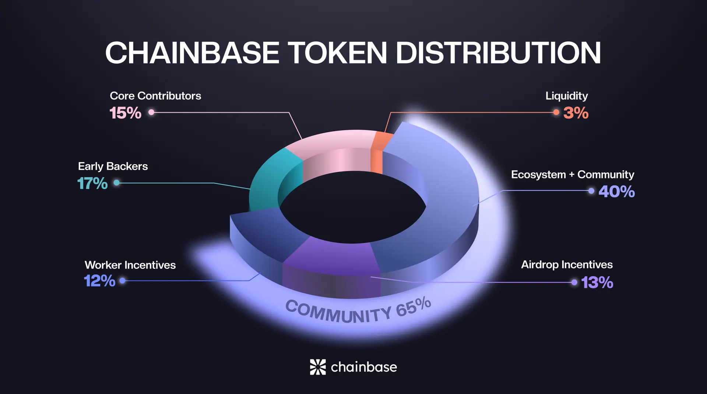
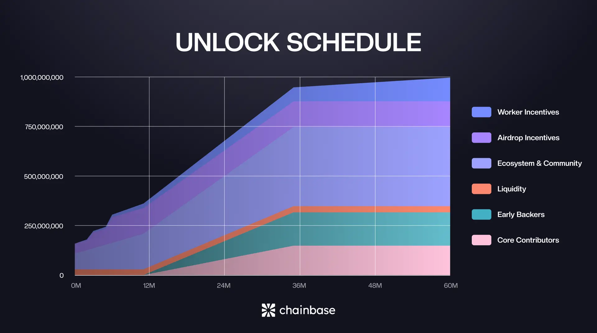

https://docs.chainbase.com/introduction/about  
https://docs.chainbase.com/introduction/networks/overview
https://docs.chainbase.com/introduction/networks/developers
https://github.com/chainbase-labs

# 概念
- Chainbase是全球最大的超数据网络**Hyperdata Network**，旨在将所有区块链数据整合到统一的生态系统中，为AI时代提供开放透明的数据互操作层。

- 双链技术架构，连接了加密数据的可编程性和可组合性，支持高吞吐量、低延迟和最终确定性，并通过双重权益模型实现更高的网络安全性。

- 使命是让数据可访问、可用。
- 通过 Chainbase，人们可以真正享受开放互联网时代的好处。

- Chainbase 正在构建 AI 超数据网络Hyperdata Network——DataFi 时代的基础层。
Chainbase 构建于超数据网络，将链上signals转换为结构化、可验证且支持 AI 的数据，这些数据可由 AI 模型和去中心化应用程序直接处理。

**其核心堆栈包括**：
- Manuscript：用于构建数据资产的可编程层
- AVS层：去中心化数据执行和验证
- C 代币：AGI 的原生货币

# 一、Chainbase网络--概述
Chainbase 网络由**运营商Operators**、**消费者Consumers**、**验证者Validators**、**开发者Developers**和**委托人Delegators**组成，他们为网络提供服务，并向 Web3 应用程序提供数据。消费者使用这些应用程序并消费数据。

## 1.**开发人员**
### 开发人员
开发者**既是网络数据的需求方，也是供给**方。开发者**创作Manuscript**并发布到网络赚取奖励，同时，在构建Dapp时查询网络数据，成为网络的用户。

### 本地开发
开发人员使用chainbase-sdk在本地构建Manuscript。该 SDK 提供了一套全面的工具和库，可简化数据转换和查询的过程。

### 测试和验证
开发完成后，Manuscript可以部署到我们的沙盒环境中，开发人员有机会提前验证他们的Manuscript，以确保没有索引错误并且它们按预期工作。

### 发布
当开发者对其Manuscript件满意时，他们可以将其发布到网络上。这是一个链上操作，用于注册Manuscript，以便索引器（运营商）可以发现它。

## 2.**运营商**
运营商在网络中扮演着至关重要的角色，他们**为执行层提供必要的计算资源**，确保数据处理任务的顺利运行。运营商的奖励机制类似于工作量证明，工作量越大，硬件要求也就越高。

## 3.**验证者**
验证者在维护网络安全和共识方面发挥着关键作用。他们负责确保数据完整性并维护网络稳定性。网络中的验证者通过**改进的 CometBFT 达成共识**，并使用 **DPOS 机制**根据质押的 $C 数据大小确定投票权重。

## 4.**委托人**
委托人通过将自己的代币质押给验证者和运营者来增强网络的经济安全性。Chainbase 网络采用双重质押机制，委托人可以选择质押$ETH (or LST)或委托$C。

# 二、开发人员
## 1. 本地开发（即将推出）
开发人员使用chainbase-sdk在本地构建Manuscript。该 SDK 提供了一套全面的工具和库，可简化数据转换和查询的过程。

### 1.设置开发环境
首先，开发人员需要设置本地开发环境。这包括安装必要的依赖项、配置 SDK 以及设置本地区块链节点进行测试。
1）安装依赖项：确保已安装 Node.js 和 npm。然后，chainbase-sdk使用 npm 安装：
npm install chainbase-sdk
2）配置 SDK：创建一个配置文件来指定本地区块链节点的连接详细信息和其他设置。
3）设置本地节点：运行本地区块链节点来模拟网络环境。这允许您在受控的环境中测试您的Manuscript。
**？？？？？？？？？注意，官方提供的npm install chainbase-sdk 还无法安装，此处缺失运行节点的说明文档，因该是开发还没有完成，还没有上线**

### 2.测试和验证
开发完成后，Manuscript可以部署到我们的沙盒环境中，开发人员有机会提前验证他们的Manuscript，以确保没有索引错误并且它们按预期工作。

### 3.沙盒环境
沙盒环境模拟主网络，但独立运行，允许开发者在不影响现有网络的情况下测试他们的Manuscript。
该环境提供了调试和性能监控工具。
1）部署手稿：使用SDK将您的手稿部署到沙盒环境。
2）运行测试：执行一系列测试来验证手稿的功能和性能。
3）调试工具：利用提供的调试工具来识别和修复任何问题。

### 4.发布
当开发者对其Manuscript满意时，他们可以将其发布到网络上。
**这是一个链上操作**，用于注册Manuscript，以便**索引器（操作员）**可以发现它。

## 5.链上注册
发布Manuscript需要进行链上部署，将Manuscript注册到网络。此过程确保Manuscript被索引，并可供其他网络参与者查询。
- 准备Manuscript：确保您的Manuscript已定稿并经过彻底测试。
- 启动部署：使用 SDK 启动链上部署以发布您的Manuscript。
- 确认：等待区块链上确认部署。确认后，您的Manuscript将正式发布并被索引。

## 6.赚取奖励
通过发布Manuscript，开发者可以根据其数据转换的使用情况和价值获得奖励。
该网络激励高质量且频繁使用的Manuscript，为活跃的开发者提供源源不断的奖励。
基于使用情况的奖励：根据您的Manuscript的查询次数和处理的数据量获得奖励。
质量激励：提供有价值数据转换的高质量Manuscript有资格获得额外激励。

# 三、运营商
运营商在网络中扮演着至关重要的角色，他们为执行层提供必要的计算资源，确保数据处理任务的顺利运行。
**运营商的奖励方式类似于工作量证明**，工作量越大，对硬件的要求也就越高。

## 1.成为运营商
要成为 Chainbase 网络中的运营商，请按照以下步骤操作：
1）**注册**：在 Holesky 测试网或 Eigenlayer 智能合约的主网上注册成为运营商。这将把你的以太坊公钥注册到 Eigenlayer 智能合约中。请按照Eigenlayer上的说明操作。
2）**设置基础设施**：确保您拥有必要的硬件和软件基础设施来支持网络的计算要求。
3）**运行节点软件**：安装并运行Chainbase节点软件即可开始参与网络。

## 2.职责
运营商负责维护和管理数据处理任务所需的计算基础设施。
1）基础设施管理：维护和管理硬件和软件基础设施，以确保高效运行。
2）数据处理：处理并执行数据开发者提交的数据查询请求。

## 3.奖励
运营者根据其提供的数据处理服务的质量和数量获得奖励。
网络激励运营者维护和优化其计算资源。

# 四、验证者
## 1.成为验证者
要成为 Chainbase 网络中的验证者，请按照以下步骤操作：
1）联系团队：联系 Chainbase 团队，表达您成为验证者的兴趣并获取详细说明。
2）满足要求：确保您满足运行验证器节点所需的硬件和软件要求。
3）注册：按照提供的说明在网络上注册为验证者。
4）设置节点：安装并配置验证器节点软件以开始参与网络。

## 2.职责
验证者负责验证交易、维护网络共识并确保数据完整性。
1）交易验证：验证并确认交易，以确保其合法性和准确性。
2）共识维护：维护网络的共识机制，防止恶意行为和攻击。
3）数据完整性：确保在网络上处理和存储的数据的完整性。
4）网络治理：通过对网络改进和发展方向提出和投票来参与网络治理。

## 3.奖励
验证者因其在维护网络安全和稳定方面所做出的贡献而获得奖励。奖励结构激励验证者有效地履行职责。

## 4.监控和性能
验证者应持续监控其节点的性能，以确保其符合网络的标准。
1）性能指标：访问性能指标来评估节点的效率和可靠性。
2）定期监控：定期检查节点的状态和性能，以确保其以最佳状态运行。
3）升级和维护：执行必要的升级和维护，以确保您的节点保持最新和安全。

# 五、委托人
## 1.质押代币
委托人可以质押他们的代币来支持验证者和运营商，为网络的安全性和稳定性做出贡献。
1）选择代币：决定是否进行质押$ETH (or $LST)或$C。
2）选择验证器/运营商：选择您想要支持的验证器和运营商。
3）质押代币：使用质押界面将您的代币委托给选定的验证者和运营商。

## 2.奖励
通过质押代币，委托人可以获得他们支持的验证者和运营商所获得的奖励份额。

# 六、代币经济学
https://docs.chainbase.com/introduction/tokenomics

## 1.人工智能时代，需要新的数据经济
- 数据是人工智能的基础。
- 随着人工智能变得更加自主并深入嵌入数字基础设施，**高质量数据已成为最宝贵的资产**。
- 然而，当前的数据系统并非为智能机器构建。
- 区块链数据仍然碎片化、非结构化、不可验证，并且缺乏定价或激励模型。
- 目前缺乏有效的数据估值、交易或协调机制。

Chainbase 引入了一项新标准：超数据网络 (Hyperdata Network)。
该网络专为 AI 原生互联网而设计，将原始区块链活动转换为结构化、可组合且机器可消费的数据。
它使自主代理、协议和人类能够通过共享数据层进行访问和协调。
这个生态系统的核心是$C。它为人工智能和更广泛的 DataFi 经济提供动力。

## 2.$C 代币
 $C 是 DataFi 生态系统的基础资产，支持跨人工智能和加密的结构化数据的生产、交换和治理。

### $C 的核心实用程序
- **数据集访问**
代理、应用程序和协议使用 $C 来查询和使用结构化数据。​

- **生态系统激励措施**
根据开发人员、贡献者和用户的活动和对网络的价值分发给他们。
​
- **去中心化执行安全**
通过 AVS 层支持和验证数据处理。
​
- **协议治理**
代币持有者对协议升级、激励模型和网络参数进行投票。
​
- **DataFi 货币**
作为整个 Chainbase 生态系统的标准记账单位和结算单位。

## 3.代币分配
Chainbase 已将 $C 总供应量的 65% 用于生态系统发展、贡献者奖励和用户激励。
这体现了 Chainbase 对开放参与和长期合作的承诺。

### 代币分配明细
- 生态系统 + 社区 (40%)：预留用于拨款、集成、开发者激励、活动奖励以及长期社区发展。此项分配支持 Chainbase 网络的开放访问和持续参与。
- 空投奖励（13%）：分三季发放，用于奖励战略合作伙伴（例如：第一季分配3.5%，包括2%的原生社区奖励和额外的1.5%的Binance Alpha）、开发者、用户、项目团队以及积极支持生态系统发展的贡献者。
- 工人激励（12%）：分配给操作数据节点并支持 Chainbase 去中心化基础设施的参与者。
- 早期支持者（17%）：为项目提供早期支持和指导的初始投资者。
- 核心贡献者（15%）：奖励创始团队成员和核心建设者，分配与长期协议成功最佳一致。
- 流动性（3%）：为交易所支持和健康的市场动态而保留。
- **总供应量**：1,000,000,000 $C
- **初始解锁供应量**：16%

### 解锁时间表
 $C 发行模型的结构旨在确保长期稳定性和有意义的参与。

### 核心团队和早期支持者
代币在 3 年内归属，其中 12 个月为锁仓期，随后 24 个月为线性分配，旨在激励长期贡献。

### 持续激励基础设施运营商
工人激励机制分配给操作数据节点的参与者，在 60 个月内线性归属，确保为 Chainbase 网络提供去中心化基础设施的持续支持。

### 生态系统相关
- 分配给生态系统发展的代币将在 36 个月内线性解锁，与开发人员的增长、激励计划和平台采用里程碑保持一致。
- 这种分阶段推出的模式使得 $C 供应量能够与实际使用量同步扩大，减轻短期投机压力，并加强对 DataFi 经济的可持续参与。

### 在 Base 和 BNB Chain 上线
 $C 将主要在 **Base 上线**，并在 BNB 智能链 (BSC) 上提供额外的流动性。这种双链模式使 Chainbase 生态系统能够：
- 利用 Base 的性能、低费用和强大的开发者生态系统；
- 通过 BSC 提供更广泛的流动性和用户群；
- 跨链效用和交易；
这种方法可确保顺利启动，并使 Chainbase 能够在 Web3 生态系统中实现长期互操作性。

### 为什么$C很重要
- 数据不再是被动的基础设施，而是资本。
- $C 将原始数据转化为经济资产。它促进自主协调，奖励真正的贡献，并实现开放的、人工智能就绪的数据经济。
- Chainbase 提供基础设施。
- $C 通过使基础设施流动起来、可扩展且人人可用来实现这一目标。

# 七、Manuscript 
**Manuscript 是一个革命性的区块链数据流框架**。通过 Manuscript，您可以将链上和链下数据无缝集成到目标数据存储中，进行不受限制的查询和分析。

## 1.Manuscript的愿景

Manuscript 的愿景是实现 Chainbase 网络内的“数据交易”，建立一个 Chainbase 生态组件，让用户能够通过任何方式、任何服务、任何语言访问任何数据。这个宏伟愿景可以分解为以下几个关键方面：
- **任意语言**：我们希望用户可以使用任意主流编程语言的脚本来定制数据，包括但不限于：Golang、Rust、Python、Node.js、Java、C/C++、Zig、WebAssembly（WASM）
- **任意方式**：不同的用户熟悉不同的数据访问方式，我们希望用户可以通过多种方式访问数据，包括但不限于：SQL、DataFrames、HTTPS、gRPC、FTP、WebDAV、FUSE
- **任何数据**：用户应该能够访问任何格式的数据，例如：JSON、CSV、ORC、XML、XLSX、BLOB
- **跨任意服务**：用户期望的数据存储服务也各不相同，我们希望用户可以在任何服务中访问、传输和控制数据，例如：RPC、S3、IPFS、Azblob、HDFS、Google Drive、BigQuery、WebDAV、MySQL、PostgreSQL

在 Chainbase 生态系统中，链上数据可以被标记、分类和处理，将复杂的数据转化为易于理解和使用的形式。人工智能算法可以自动分析海量区块链数据，发现隐藏的模式、趋势和异常，帮助用户从数据中获得洞察。
Manuscript 为这一过程提供了丰富的工具和资源，使数据处理更加高效透明。通过这些技术手段，Manuscript 不仅使链上数据的访问更加自由灵活，也极大地提升了数据的价值，让更多人能够轻松地使用和应用这些链上数据。

## 2.Manuscript价值
- **可编程性**：Manuscript 提供强大的可编程接口，允许开发者根据自身需求定制数据处理工作流程。这种灵活性意味着 Manuscript 不仅可以用于简单的数据查询，还可以用于构建复杂的数据分析流程和应用程序。Manuscript 的可编程性为区块链数据的创新应用开辟了无限可能。
- **互操作性**：随着区块链技术的蓬勃发展，不同区块链之间理解和处理彼此数据的难度日益加大。Manuscript 可以解决多链及链下数据聚合在任意维度上的互操作性问题。通过提供统一的接口和数据处理方法，Manuscript 实现了不同区块链数据的无缝集成，大大提升了跨链应用的开发效率和可行性。
- **变现**：Chainbase 依托 Manuscript 提供的数据能力，结合 CometBFT + DPoS 双链架构、高性能即时交易最终确定性和权益证明共识机制，构建了一个公平透明的数据价值交换生态。数据创造者可以通过 Manuscript 将处理后的数据变现，数据使用者也可以便捷地消费所需的数据。这种机制不仅激励了高质量数据的产出，也促进了整个区块链生态的良性发展。

## 3.Manuscript设计
Manuscript 作为 Chainbase 网络中的数据访问层(DA???)，需要对接大量现有的数据协议。
其核心设计理念围绕模块化和可扩展性，由以下关键组件构成：

- **Accessor (Data Source)**:
作为最底层的接口，所有服务都需要实现该接口，负责将上层调用转换为下层请求
例如，将读取请求转换为相应的服务 API 调用
提供统一的数据访问抽象，屏蔽底层存储和服务的差异

- **Processor (Data Method)**:
面向用户的高级方法，允许他们方便地创建读写请求
提供SQL语法、初始化数据集等操作。
封装复杂的数据互操作底层逻辑，提供简洁的用户界面

- **Handler (Data Target)**:
处理具体的读写请求，管理数据对象的生命周期，实现数据的序列化和反序列化
处理数据一致性和并发问题
例如，将用户处理的数据写入本地关系数据库，如MySQL，PostgreSQL等。

- **Signer (Proof of Stake)**:
允许用户预生成签名URL，支持临时授权访问，增强数据访问的安全性
基于智能合约实现权限管理和权益分配证明接口

## 4.Manuscript-gui的使用
目前我的测试环境是linux，没有现成的编译好的应用可用，需要手动编译，如何编译，请教AI
https://github.com/chainbase-labs/manuscript-core/
**注意，mac可能有现成编译好的应用，可以直接下载安装使用。2025年8月4日。**

程序打开以后，可以按照官方的说明进行debug操作：我按照官方的说明操作成功了，可以拿到数据，所以这里不再赘述。
https://docs.chainbase.com/core-concepts/manuscript/QuickStart/create_manuscript

这里说一下部署的事情：

# 八、Manuscript高级功能
##  1.概述
Chainbase Network 中的数据集就像是未提炼的初级矿物，**炼金术士（开发者）**可以使用 Manuscripts 来处理这些数据，从现有的数据中提取更大的价值。

## 2.协议
Chainbase Network 致力于让数据（链上和链下）更易于访问，因此 Manuscripts **允许用户和开发人员使用 SQL**查询和处理数据。

### Manuscripts的组成
- Schema：数据集的定义。
- Operators：提取、转换、加载方法，用于从现有数据中提取更大的价值。
下面这个图就是我在本地linux环境中测试的

其中ethereum.blocks是chainbase网络中已经存在的数据集，可以通过NETWORK页面，查看该数据集的相关信息。
从官网文档的描述来看，开发人员可以创建架构，定义数据集，然后使用Manuscripts，编写sql来处理数据。
开发人员需要定义结果表的模式，包括字段名称、字段类型和字段描述。

### 通用许可证
对于经验丰富的炼金术士来说，可以使用通用编程语言 (GPL)，例如 Python 或 JavaScript，来提取和处理数据。GPL 将提供最灵活、最强大的数据提取功能。
**即将推出… （当前文档事件：2025年8月6日）**

# 九、Chainbase Zone
## 1.概述

- Chainbase Zone 是 Manuscript 框架内一个专门的数据处理域，专注于解析和分析特定行业或用例的区块链数据。
- Zone 是 Manuscript 实现的集合，它们协同工作，为特定的区块链领域提供全面的数据解决方案。

## 2.Chainbase 中的Zone提供了几个关键功能：
1. **数据专业化**：专注于特定的区块链领域（DeFi、NFT、游戏等）；
2. **自定义处理**：为您的域定义专门的数据处理工作流程；
3. **互操作性**：连接多种数据源和输出格式；
4. **货币化**：通过向网络提供有价值的处理数据来获得奖励；

## 3.区域角色和工作流程
Chainbase Zone生态系统由多个关键角色组成，它们共同努力确保高效、高质量的数据处理。

**1）核心角色**
(1). Zone Owner
- 负责创建和管理特定领域的数据处理场景
- 定义区域的业务范围和技术规范
- 审查并更新区域内的稿件
- 管理区域的经济模型和奖励机制

(2). Alchemist/ˈælkəmɪst/炼金术士（开发者）
- 根据区域规范制定手稿
- 实现并优化数据处理逻辑
- 提供技术支持和维护
- 参与区域技术升级讨论

(3). 运营商
- 选择并运行特定区域
- 提供计算资源和基础设施支持
- 确保区域内所有稿件稳定运行
- 监控系统性能并处理异常

**2） 工作流程**

## 4. 创建 Chainbase Zone
**1）部署区域的推荐流程**
在主网上部署您的第一个区域之前，我们**强烈建议遵循以下顺序**：
1. 本地开发：使用示例数据处理工作流程在本地创建和测试您的区域
2. 测试网部署：在 Chainbase 测试网上部署您的区域以验证您的数据处理管道
3. 主网启动：经过全面测试后，在 Chainbase 主网上部署您的区域

**2）先决条件**
要创建区域，请确保您具有：
- 安装 Chainbase Manuscript 框架；
- 创建了 emv 钱包；

3）创建本地Zone
**步骤 1**. 设置本地开发环境
**注意：这个方法就是我前面说的自己编译的方法，还需要配套的编译环境，可以咨询AI自行安装。** ####Install Manuscript core dependencies####
git clone https://github.com/chainbase-labs/manuscript-core
cd manuscript-core
make install gui # or cli

**步骤2**. 配置区域（即将推出.. 当前是2025年8月6日笔记）
Ⅰ. **区域生命周期管理**
**性能监控**
区域评估基于以下标准：
(1). 数据处理吞吐量
(2). 查询响应时间
(3). 错误处理数据准确性和完整性
(4). 网络利用率
​
**注销注册**
如果出现以下情况，绩效不佳的区域可能会被取消注册：
(1).持续未能达到绩效指标
(2).处理无效或损坏的数据
(3).违反网络政策
​
Ⅱ.**最佳实践**
(1). **测试**：在主网部署之前彻底测试区域的数据处理管道
(2). **文档**：维护区域功能和用途的清晰文档
(3). **监控**：对区域性能实施强有力的监控
(4). **更新**：定期更新区域的组件以保持兼容性和安全性
​
Ⅲ. **社区贡献**
Chainbase Zones 的成功取决于社区的参与。贡献者可以：
(1).为不同的区块链领域开发新的专业区
(2).改进现有区域实施
(3).分享区域模板和最佳实践
(4).参与区域治理决策

**有关为 Chainbase 生态系统做出贡献的更多信息，请访问我们的社区指南。https://docs.chainbase.com/contributing/overview**

