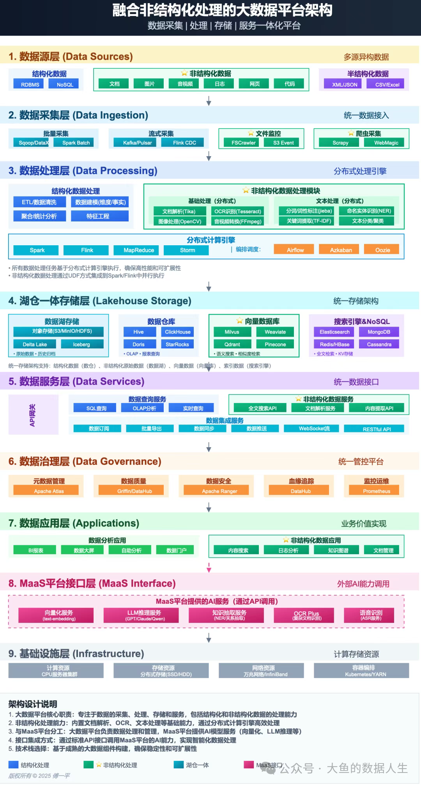
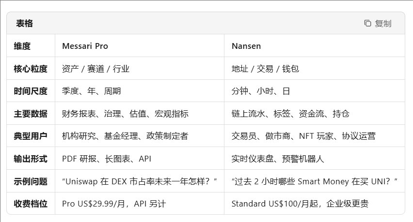
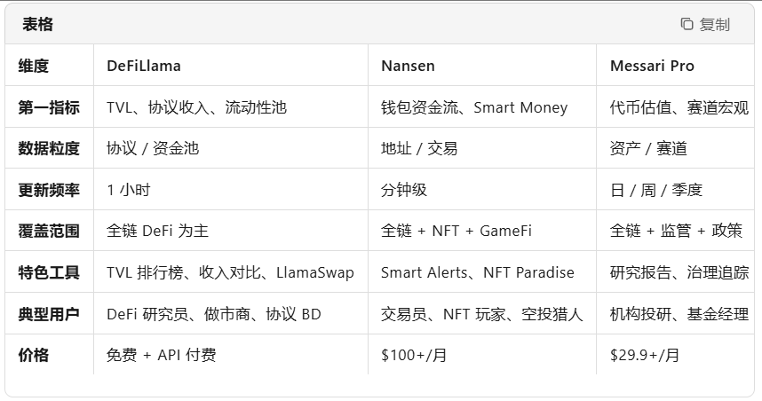

# 前置知识
一张融合非结构化处理的大数据平台架构蓝图

# 知名的区块链数据分析网站
## Nansen 
是一个**链上数据“情报平台”**，把区块链上地址级别的原始流水，加工成带标签、带场景的“**谁、什么时候、干了什么**”的可视化结论，帮助用户做**交易**、**投研**、**风控**、**运营**四类决策。
### 它到底“分析”什么维度？
1. **钱包画像（Who）**
• 把 2 亿+ 地址按行为贴上 200+ 标签：Smart Money、基金、矿工、MEV Bot、NFT 鲸鱼、空投猎人、CEX 2. 冷热钱包……
• 实时计算每个标签的盈亏、胜率、持仓结构，生成“Smart Money leaderboard”。
3. **资金流向（What & How much）**
• 追踪 ERC-20、NFT、DeFi 代币在多链（Ethereum、Polygon、Arbitrum…）的净流入/流出。
• 拆解到交易所、DEX 池子、合约、跨链桥，粒度可到单笔交易。
4. **事件场景（When & Why）**
• 监控治理提案、巨鲸异动、黑客攻击、空投申领、协议升级等事件，给出秒级预警与回溯报告。
• 例子：Curve 被攻击后 30 分钟内推送“哪些 Smart Money 在倾销 CRV”。
5. **市场细分赛道**
• NFT：地板价、持有者集中度、挂单墙、蓝筹指数。
• DeFi：锁仓变化、收益率曲线、清算事件。
• GameFi & SocialFi：活跃钱包留存、道具交易热力图。

### 数据流程一句话
链上原始日志 → Nansen 自研 ETL（解码、去重、补全）→ 打标签引擎（链上+链下信号）→ OLAP 存储 → 可视化 / API / SQL

### 核心产品模块
- Smart Alerts（实时预警）
用户可自定义规则：当某 Smart Money 地址 24h 内累计买入 >1000 ETH 的某个代币时推送 TG/Discord。
- Wallet Profiler（地址显微镜）
输入 0x… 地址，立即看到：盈亏曲线、历史持仓、最近交互协议、关联地址图谱。
- Token God Mode（代币上帝视角）
一个面板看尽：交易所余额变化、前 100 持仓地址、聪明钱进出、链上衍生品未平仓。
- NFT Paradise / NFT God Mode
地板价、挂单深度、鲸鱼扫货、鲸鱼挂单，全用标签过滤。
- Nansen Query（付费企业级 SQL）
把 Nansen 清洗后的表（带标签）直接拖到 Dune 类界面写 SQL，或导出到 BigQuery 做二次建模。

## Messari
Messari Pro = 宏观研究 + 长周期基本面（像“Web3 的彭博终端”）；
Nansen = 微观链上实时情报 + 钱包级交易信号（像“链上显微镜+交易雷达”）。

### Messari  到底“做什么分析”？
1. 资产级基本面
• 对 2500+ Token & 200+ 协议做标准化季度/年度报告：代币经济、治理、路线图、现金流、估值模型。
• 关键指标：Revenue、P/S、P/F、FDV、质押率、通胀率、费用捕获率、国库余额。
2. 赛道/行业宏观
• 每周《The Protocol》：追踪 L1/L2、DeFi、LSD、RWA 等 10+ 赛道的收入、TVL、用户数变化。
• 每月《Crypto Theses》：年度趋势预测（监管、技术栈、资金流向）。
3. 监管 & 政策追踪
• 实时更新各国监管动态、ETF 审批进度、MiCA、FASB 会计规则，并量化对价格/资金流入的影响。
4. 事件 & 治理
• 对重大升级（Ethereum Cancun、Cosmos 2.0、Uniswap v4）做影响评估模型：Gas 节省、收入影响、代币供需。
5. 图表 & 数据 API
• 200+ 标准化图表：ETH L2 费用市场份额、DEX 交易量市占率、稳定币流通量。
• 企业级 API：可直接拉 Messari 清洗好的时间序列进 Excel/BI 工具。

### 类比传统行业
• Messari Pro ≈ 彭博/标普：给股票/债券的基本面、行业报告。
• Nansen ≈ 交易所盘口+Level-2：给逐笔成交、大单追踪、主力资金。

## DeFiLlama 
DeFiLlama = “链上 TVL 与协议现金流的实时仪表盘”；
Messari = 宏观基本面研究；
Nansen = 钱包级交易情报。

### 一、DeFiLlama 到底“做什么分析”？
1. 核心指标——TVL（Total Value Locked）
• 覆盖 300+ 条链、3000+ 协议、1 万+ 池子，每小时更新。
• 可拆分为：DEX、Lending、Derivatives、Liquid Staking、Bridge、预言机 等 100+ 赛道。
2. 现金流 & 收入
• 每个协议的收入、费用、代币激励、净利润、P/F、P/S 曲线（Revenue 模块）。
• 支持按日 / 周 / 月查看，直接导出 CSV。
3. 比较 & 筛选器
• “链 vs 链”“协议 vs 协议”“池子 vs 池子”拖拽式对比。
• 一键生成排行榜：最高收益、增长最快、最大回撤。
4. 实时事件
• 治理提案、黑客攻击、奖励调整 → 在对应协议页出现红色事件标签，并联动 TVL/收入曲线。
5. 衍生产品
• LlamaSwap：比价跨链路由；
• LlamaFolio：输入地址生成 DeFi 资产+收益总览；
• API：免费 / 付费，供量化/媒体直接拉数据。

## 三平台对照速查表

## 使用场景一句话
• 想知道 哪些DEFI协议的指标 → 打开 DeFiLlama 看。
• 想知道 某巨鲸刚把 1 万 ETH 存进 Lido → 去 Nansen Wallet Profiler 查地址。
• 想写 LSDfi 赛道 30 页投研报告 → 先在 Messari Pro 下载 LSD 季度报告，再用 DeFiLlama 补最新 TVL 图表。

## 一句话总结
DeFiLlama 像 DeFi 领域的“CoinMarketCap + 现金流 Bloomberg”；
Nansen 像 链上交易雷达；
Messari 像 宏观研报库。
三者互补：DeFiLlama 给“量”，Nansen 给“谁”，Messari 给“为什么”。

**关于desci数据看板的一些信息**

# 内容设计：3 张核心图表 + 1 个洞察
## 1.DeSci 资金热度
横轴：时间（周），纵轴：每周新增融资额（USD）。
亮点：用 7 日滚动平均平滑空投噪音，展示数据清洗功力。
## 2.项目里程碑准时率
雷达图：把 VitaDAO、HairDAO、ValleyDAO 等 5-8 个项目做成多边形。
亮点：把链上“milestoneReached”事件映射成布尔值，体现语义建模。
## 3.作者/审稿人信誉分
力导向图：节点=地址，边=引用/评审关系。
亮点：用 PageRank 算声誉，可解释“为什么这个地址值得信任”。
## 关键洞察（一句话）
“过去 6 个月 DeSci 赛道融资 80% 流向长寿医学子领域，但实验里程碑准时率低于 35%，存在投后管理数据缺口。”

# 合约地址清单：
|项目名称  |  国库/众筹合约（如 VitaDAO Treasury）|   IP-NFT 合约（如 Molecule IP-NFT）| DAO Governor 合约（投票事件）|Token 合约（ERC-20/721）|区块高度范围（Block Range）

