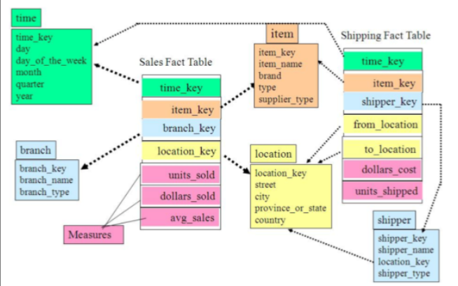
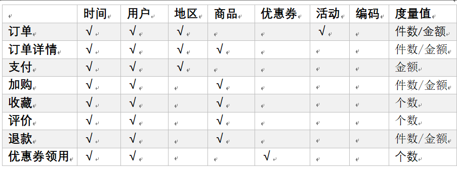

# 前置基础概念
## **1. 关系模型的主要概念**
**第一范式**：属性不可切割，或者叫做原子性。即一个表中不能有两个相同的属性，或者一个属性不能再分解为多个子属性。

**第二范式**：不能存在“部分函数依赖”，必须是完全依赖。

**第三范式**：不能存在传递函数依赖

关系建模：

关系模型如图所示，严格遵循第三范式（3NF），从图中可以看出，较为松散、零碎，
物理表数量多，而数据冗余程度低。由于数据分布于众多的表中，这些数据可以更为灵活地
被应用，功能性较强。关系模型主要应用与 OLTP 系统中，为了保证数据的一致性以及避免
冗余，所以大部分业务系统的表都是遵循第三范式的。

## **2.维度建模1：**

维度模型如图所示，主要应用于 **OLAP 系统中**，通常以某一个事实表为中心进行表的
组织，主要面向业务，**特征是可能存在数据的冗余，但是能方便的得到数据**。
**注意：**关系模型虽然冗余少，但是在大规模数据，跨表分析统计查询过程中，会造成多表关
联，这会大大降低执行效率。
所以**通常我们采用维度模型建模**，把相关各种表整理成两种：**事实表和维度表两种**。

## **3.维度建模2：**
在维度建模的基础上又分为三种模型：星型模型、雪花模型、星座模型。
- 星型模型

雪花模型与星型模型的区别主要在于维度的层级，标准的
星型模型维度只有一层，而雪花模型可能会涉及多级。

- 雪花模型

雪花模型，比较靠近3NF，但是无法完全遵守，因
为遵循3NF的性能成本太高。

- 星座模型

星座模型与前两种情况的区别是事实表的数量，星座模型是
基于多个事实表。基本上是很多数据仓库的常态，因为很多数据仓库都是多个
事实表的。所以星座不星座只反映是否有多个事实表，他们之间
是否共享一些维度表。
所以星座模型并不和前两个模型冲突。

## **4.维度表和事实表**
### 1）维度表
**一般是对事实的描述信息**。每一张维表对应现实世界中的一个对象或者概念。
例如：用户、商品、日期、地区等。
- **维度表的特征：**
  维表的范围**很宽**（具有多个属性、列比较多）；
  跟事实表相比，**行数相对较小**：通常< 10 万条；
- 举例时间维度表：

### 2）事实表
事实表中的每行数据代表一个业务事件（下单、支付、退款、评价等）。
“事实”这个术语表示的是**业务事件的度量值**（可统计次数、个数、件数、金额等），例如，订单事
件中的下单金额。
每一个事实表的行包括：具有可加性的数值型的度量值、与维表相连接的外键、通常具
有两个和两个以上的外键、外键之间表示维表之间多对多的关系。
**事实表的特征：**
- 非常的大
- 内容相对的窄：列数较少
- 经常发生变化，每天会新增加很多。

（1）**事务型事实表**
以每个事务或事件为单位，例如一个销售订单记录，一笔支付记录等，作为事实表里的
一行数据。一旦事务被提交，事实表数据被插入，数据就不再进行更改，其更新方式为增量
更新。
（2）**周期型快照事实表**
周期型快照事实表中**不会保留所有数据，只保留固定时间间隔的数据**，例如每天或者
每月的销售额，或每月的账户余额等。
（3）**累积型快照事实表**
**累计快照事实表用于跟踪业务事实的变化。**
例如，数据仓库中可能需要累积或者存储订单从下订单开始，到订单商品被打包、运输、和签收的各个业务阶段的时间点数据来跟踪订单声明周期的进展情况。**当这个业务过程进行时，事实表的记录也要不断更新**

## **4.模型选择**
- 首先就是星座不星座，这个只跟数据和需求有关系，跟设计没关系，不用选择。
- 星型还是雪花，**取决于性能优先，还是灵活更优先**。
- 目前实际企业开发中，不会绝对选择一种，根据情况
- 灵活组合，甚至并存（一层维度和多层维度都保存）。
- 但是整体来看 ，**更倾向于维度更少的星型模型** 。

# 一、数仓概念
## 1.1数仓分层架构的定义
数仓分层架构：是一种将数据仓库按照数据处理逻辑与功能定位划分为多个层级的系统性架构设计模式，其核心是通过分层实现数据从原始采集到价值输出的全流程规范化管理。
通常包括 ODS（操作数据存储层）、DWD（明细数据层）、DWS（汇总数据层）、ADS（应用数据层）等典型层级：
- ODS 层直接对接源系统，以原始格式存储数据，确保数据完整性与可追溯性；
- DWD 层对原始数据进行清洗、标准化转换及维度关联，形成干净的明细数据；
- DWS 层按主题域对明细数据进行聚合与轻度汇总，构建面向分析的中间层数据；
- ADS 层则基于上层数据进一步加工，生成直接服务于业务场景的应用数据。

这种分层架构通过明确各层功能边界，实现数据解耦、血缘追踪、复用计算、屏蔽源系统复杂性等目标，使数据处理流程更具模块化、可维护性与扩展性，最终在数据存储成本、计算效率、分析灵活性之间达成平衡，为企业数据分析与决策提供结构化的数据支撑体系。

## 1.2数仓分层架构的核心价值
1） **构建清晰的数据架构与逻辑关系分层明确功能边界：**
各层承担专属职责（如 ODS 层存储原始数据、DWD 层清洗明细数据、DWS 层聚合汇总），形成类似 “收纳箱 + 书架” 的结构化体系，用户可快速定位数据源头与处理阶段。统一跨系统数据建模：针对源系统复杂的数据关系（如金融业务中分散的客户、交易数据），通过分层整合构建标准化数据模型，消除数据冗余与歧义，使数据关联更直观。提升数据质量：通过 DWD 层标准化清洗（如补充电商订单缺失地址、统一价格格式），去除脏数据，为后续分析提供可靠基础。

2） **实现数据血缘追踪与问题定位当业务表数据异常时，可通过分层逻辑快速追溯数据流向：**
若来源表出错，能精准定位到问题所在层次（如 ODS 层抽取异常或 DWD 层转换逻辑错误），并明确影响范围，避免 “牵一发而动全身”，高效维护数据准确性。

3）**促进数据复用与开发效率提升减少重复计算：**
- 通过公共中间层（如 DWS 层预汇总销售额），下游应用可直接复用计算结果，避免重复逻辑开发。
- 避免重复抽取：下层数据包含上层所需全量信息（如 DWD 层已处理的用户行为数据），新业务开发无需从源系统重新抽数，节省时间成本。
- 降低存储与计算开销：通过复用中间层数据，减少冗余存储与重复计算，实现 “一次加工、多次使用”。

4）**简化复杂任务与增强可维护性分而治之的任务拆解：**
- 将复杂数据处理（如多业务数据整合）拆解为分层步骤（ODS 抽数→DWD 清洗→DWS 聚合），每层仅处理单一逻辑，降低复杂度。
- 屏蔽业务变更影响：当源系统升级或规则变更（如新增字段），只需调整对应层次（ODS/DWD 层）的处理逻辑，下游应用无需修改，确保数据稳定性。
- 规范数据接口：统一源头系统复杂的表命名、字段含义（如旧业务系统数据），通过分层标准化处理，为下游提供简洁规范的数据接口。

5）**优化数据处理性能与扩展性**
- 以空间换时间提升查询效率：通过 DWS 层预聚合、维度退化等手段冗余存储数据，减少上层查询时的计算量（如直接调用按月汇总数据），提升响应速度。
- 灵活适配业务扩展：新增数据源或指标时，只需在对应层次（如 ODS 层接入新数据、DWD 层补充清洗逻辑）扩展，无需重构整个数据仓库，适应企业业务动态发展。

# 二、数仓分层架构的常见模式与实践应用
## 2.1经典四层架构：标准化数据处理的基石
经典四层架构是数据仓库领域最基础且应用最广泛的分层模式，其核心在于通过明确的数据处理阶段划分，实现从原始数据到业务应用的全流程管理，具体分层及功能如下：
### 1）ODS（Operation Data Store）- 操作数据存储层
- **定位**：数据仓库的 “入口层”，直接对接业务系统数据源。
- **核心功能**：实时或定时采集业务系统原始数据（如订单、用户行为日志），保持数据原貌不做修改；
作为数据血缘追踪的起点，记录数据来源系统、采集时间等元信息；
为下游提供统一的数据接入接口，屏蔽源系统数据格式差异（如不同业务库的表结构、字段命名）。
- **实践特点**：数据保留周期较短（通常按天或周归档），存储形式与源系统高度一致，不做清洗或转换。

- **hdfs上的数据存储实践：**
（1）保持数据原貌不做任何修改，起到备份数据的作用。
（2）数据采用压缩，减少磁盘存储空间（例如：原始数据 100G，可以压缩到 10G 左右）
（3）创建分区表，防止后续的全表扫描

### 2）DWD（Data Warehouse Detail）- 数据仓库明细层
- **定位**：原始数据到可用数据的 **“清洗转换层”**。**需构建维度模型**，一般采用**星型模型**，呈现的状态一般为**星座模型**。
- **核心功能**：
数据清洗：去除脏数据（如空值、异常格式）、重复数据，补充缺失值（如通过规则填充地址信息）；
数据标准化：统一字段命名、数据类型（如将不同系统的 “金额” 字段统一为数值型），规范业务含义（如统一 “订单状态” 枚举值）；
维度关联：将分散在不同源表的维度信息（如用户表、商品表）通过主键关联，形成宽表，便于下游查询；
- **模型构建**：基于第三范式（3NF）或维度建模（星型模型）构建明细数据模型，保留数据细节。
- **实践价值**：为后续分析提供干净、规范的明细数据，是数据复用的核心层。

#### 维度建模一般按照以下五个步骤：
选择业务过程→声明粒度→确认维度→确认事实
（1）选择业务过程
在业务系统中，挑选我们**感兴趣**的**业务线**，比如下单业务，支付业务，退款业务，物流业务，**一条业务线对应一张事实表**。
- 如果是中小公司，尽量把所有业务过程都选择。
- 如果是大公司（1000 多张表），选择和需求相关的业务线。

（2）声明粒度
- 数据粒度指数据仓库的数据中**保存数据的细化程度或综合程度的级别**。
- 声明粒度意味着**精确定义事实表中的一行数据表示什么**，应该尽可能**选择最小粒度**，以此来应各种各样的需求。
- 典型的粒度声明如下：
a、订单当中的每个商品项作为下单事实表中的一行，粒度为每次。
b、每周的订单次数作为一行，粒度为每周。
c、每月的订单次数作为一行，粒度为每月。
d、如果在 DWD 层粒度就是每周或者每月，那么后续就没有办法统计细粒度的指标了。**所以建议采用最小粒度。**

（3）确定维度
**维度的主要作用是描述业务的事实**，主要表示的是“谁，何处，何时”等信息。
确定维度的**原则是：后续需求中是否要分析相关维度的指标**。
例如，需要统计，**什么时间下的订单多**，**哪个地区下的订单多**，**哪个用户下的订单多**。需要确定的维度就包括：**时间维度、地区维度、用户维度**。
**维度表**：需要根据维度建模中的星型模型原则进行**维度退化**。

（4）确定事实
- 此处的“**事实**”一词，指的是**业务中的度量值**（次数、个数、件数、金额，可以进行累加），例如订单金额、下单次数等。
- **在 DWD 层**，以业务过程为建模驱动，基于每个具体业务过程的特点，**构建最细粒度的明细层事实表。** 
- **事实表可做适当的宽表化处理**。

（5）事实表和维度表的关联
- 关联比较灵活，
- 但是为了应对更复杂的业务需求，可以将能关联上的表尽量关联上。
- 如何判断是否能够关联上呢？在业务表关系图中，只要两张表能通过中间表能够关联上，就说明能关联上。

至此，数据仓库的维度建模已经完毕，**DWD层是以业务过程为驱动**。

### 3）DWS（Data Warehouse Summary）- 数据仓库汇总层
- **定位**：面向主题的 “聚合计算层”。
- **核心功能**：数据聚合：**按**时间（日 / 月 / 年）、地域、用户群体等**维度**对 DWD 层数据进行**汇总**（如按月份统计各地区销售额）；
- **轻度冗余设计**：为提升查询效率，允许跨维度预计算（如同时按 “时间 + 商品类别” 聚合），以空间换时间.
- **主题域划分**：按业务主题（如用户主题、交易主题）构建汇总模型，避免重复计算（如下游报表直接使用 DWS 层的汇总结果）。
- **实践特点**：数据粒度高于 DWD 层，存储周期更长，是支撑报表和轻度分析的核心层。
- **总结**：
a、需要建哪些表：以维度为基准，去关联对应多个事实表;站在维度的角度去看事实表，看事实表的度量值
b、宽表里面的字段：是站在不同维度的角度去看事实表，重点关注事实表聚合后的度量值。
- **电商DWS层宽表举例：**
DWS层宽表包括：每日设备行为、每日会员行为、每日商品行为、每日活动统计、每日地区统计。

4）ADS（Application Data Service）- 数据应用层
- 定位：直接服务业务的 “结果输出层”。
- 核心功能：基于 DWS 层汇总数据，定制化开发业务报表（如 dashboard、运营看板）、即席查询数据集；为前端应用（如 BI 工具、推荐系统）提供结构化数据服务，支持 API 接口或文件输出；
- 针对特殊场景做数据二次处理（如数据脱敏、权限过滤），确保数据安全合规。实践场景：典型应用包括财务报表、用户增长分析看板、营销活动效果数据集市等。

## 2.2  三层简化架构：轻量级场景的效率优先选择
对于初创公司或业务逻辑简单的场景，三层架构通过合并核心层简化数据处理流程，降低建设成本：
- ODS 层：功能与经典架构一致直接采集原始数据，作为数据仓库的唯一入口。
- DW 层：整合 DWD 与 DWS 的核心功能
a、一体化处理：在同一层完成数据清洗、标准化、维度关联及轻度聚合；
b、模型简化：采用宽表设计，将明细数据与常用聚合结果合并存储（如订单明细表直接包含按店铺汇总的统计字段）；
c、适用场景：数据量较小、业务分析需求单一（如仅需基础报表）的场景，避免过度分层导致资源浪费。
- APP 层：功能与 ADS 层一致直接面向业务应用提供数据服务，省略复杂的中间层逻辑。

## 2.3 不同分层模式的实践选择逻辑

