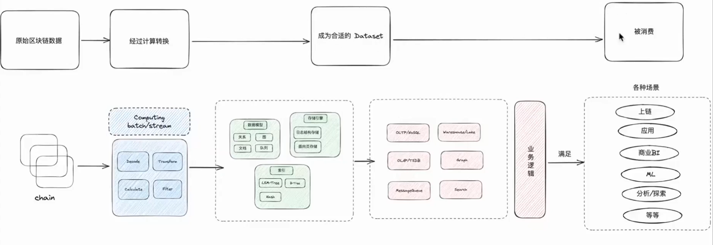
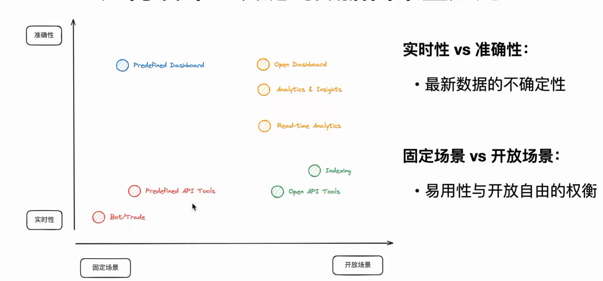
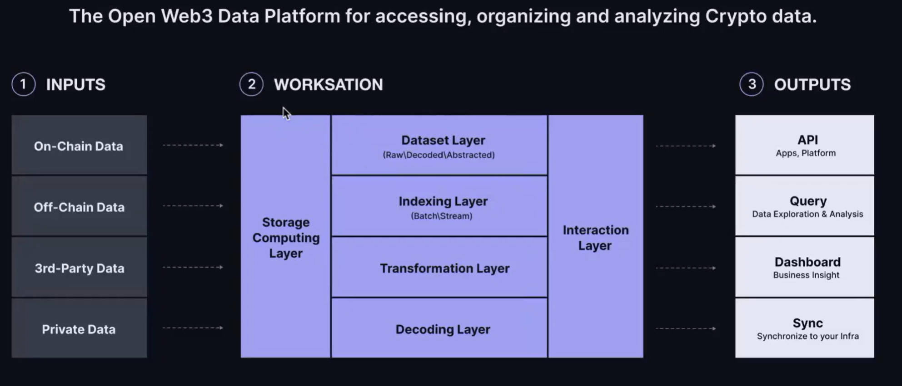
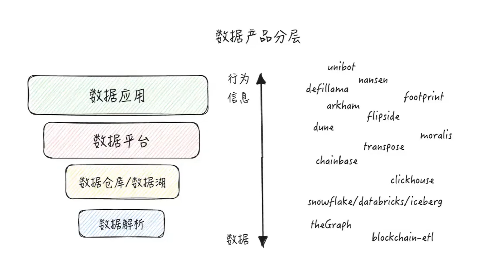
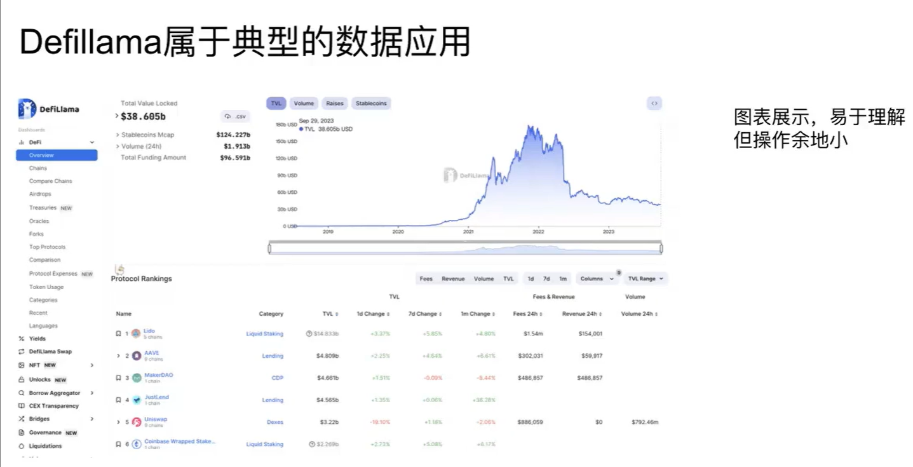

**Ⅰ-- 以太坊**
# 在以太坊和 Solidity 中，默认的全局变量、状态变量或特殊属性
由以太坊虚拟机（EVM）或 Solidity 语言自动提供，无需显式声明即可直接使用。

## 一、Solidity 全局变量（直接可用）
这些是 Solidity 内置的全局变量，主要用于获取区块链上下文信息或常用操作：

**1. 区块和交易信息**
变量名	       类型	                说明
block.number	  uint	     当前区块的编号（最新区块高度）。
block.timestamp	  uint	   当前区块的时间戳（秒级，由矿工设置，不完全可靠）。
block.coinbase	  address	 当前区块的矿工地址（打包该区块的矿工收益地址）。
block.difficulty	  uint	当前区块的难度值（PoW 链适用，如以太坊主网合并前）。
block.gaslimit	  uint	  当前区块的 Gas 上限。
block.chainid	  uint	    当前链的 ID（如以太坊主网为 1，Goerli 为 5）。
msg.sender	  address	    当前调用者的地址（可能是 EOA 或合约，直接触发当前函数的账户）。
msg.value	  uint	        随交易发送的 ETH 金额（wei 单位），仅在 payable 函数中有效。
msg.data	  bytes	        完整的调用数据（calldata）。
msg.sig	   bytes4	        函数选择器（调用函数的前 4 字节，如 keccak256("foo()") 的前 4 字节）。
tx.origin	address	        原始交易发送者（EOA 地址），慎用（可能被钓鱼攻击）。
tx.gasprice	uint	        当前交易的 Gas 单价（单位：wei/gas）。

**2. 合约自身信息**
变量名	类型	说明
address(this)	address	当前合约的地址。
this	address	同 address(this)（不推荐使用，可能在未来版本弃用）。
type(C).name	string	合约 C 的名称（仅对合约类型有效）。

**3. 数学和哈希**
变量名	类型	说明
blockhash(uint blockNumber)	bytes32	返回指定区块号的哈希（仅对最近的 256 个区块有效）。
keccak256(bytes memory)	bytes32	计算 Keccak-256 哈希（常用于生成随机数或验证数据）。
sha256(bytes memory)	bytes32	计算 SHA-256 哈希。
ripemd160(bytes memory)	bytes20	计算 RIPEMD-160 哈希。

## 二、合约默认状态变量
合约账户在 EVM 层面还有一些隐式存储的属性（尽管 Solidity 中不直接暴露为变量）：

1.合约字节码
通过 address(code).code 获取（Solidity 0.8.0+ 支持）。
**示例：**
solidity
bytes memory contractCode = address(contractAddress).code;

2.合约存储槽（Storage Slots）
合约的状态变量按规则存储在固定的存储槽中，可通过内联汇编访问（如 sload/sstore）。
合约自毁状态
合约是否已被 selfdestruct 标记（无法通过 Solidity 直接读取，需通过 extcodesize 检查）。

## 三、EVM 底层变量（需内联汇编访问）
以下变量需要通过 Solidity 的 assembly 块访问：

变量名	说明
gasleft()	剩余 Gas（等同 Solidity 的 gasleft() 函数）。
caller()	调用者地址（类似 msg.sender，但在汇编中可能受 delegatecall 影响）。
callvalue()	随调用发送的 ETH 金额（类似 msg.value）。

示例：
function getRemainingGas() public view returns (uint256) {
    uint256 gas;
    assembly {
        gas := gasleft()
    }
    return gas;
}

## 二、以太坊区块链，哪些数据可以直接从区块交易中获取？
1. 公开的链上数据
- 交易（Transaction）：

发送者（from）、接收者（to）、转账金额（value）、输入数据（input）、Gas 费用等。

通过区块的 transactions 字段直接获取。

- 事件日志（Logs）：

合约中通过 emit 触发的事件（如 Transfer(address,address,uint256)）。

存储在交易的 logs 字段中，可通过事件签名和索引过滤。

- 区块头信息：

区块号（number）、时间戳（timestamp）、矿工地址（coinbase）、Gas 限制等。

通过区块的 header 字段获取。

2. 无法直接从交易中获取的数据
1）合约的内部状态变量（如 uint256 private balance;）：

除非变量是 public 且自动生成 getter 函数，否则无法直接读取。

需要通过调用合约的视图函数（view/pure）或直接查询存储槽（需知道存储布局）。

2）动态计算的全局变量（如 block.difficulty）：

需在合约执行时由 EVM 计算，交易中仅记录结果，不存储原始值。

# 原始的区块链数据无法聚合、排序、搜索、筛选

# 构建数据密集型应用
## 一、区块链的数据密集型应用
1. **定义**：依赖数据提供核心价值；
2. **特点**：
- 数据量
- 复杂度
- 快速多样化
3. **应用场景**：
- 搜索引擎
- 社交媒体平台
- 流媒体服务
- 其他等等。。。。。。

## 二、区块链数的特性和挑战
1. 优势：
- 透明，不可篡改
- 高价值：自主权的数据
  - 资产，身份，交易等；
- 高质量：有序，完整，唯一 
2.挑战：
- 存储持续增长
- 不是为了数据检索涉及
- 结构化，但是无法解释 
3.解决了什么问题
 

## 三、如何实际区块链的数据密集型应用

左边固定场景，右边开放场景
- 应用举例：
**the  graph**：偏数据的实时索引；主要是自己编写发布的合约，要将合约的数据进行搜集和发布，就用这个。但他不能做数据探索。
**dune**：更全面和准确的数据，能够做数据探索。

- 资金追踪，大额交易预警系统的制作
- 数据挖掘路线
找到数据源；目标数据特征化；大额交易筛选；构建链上交易预警机器人；

行式存储，列式存储，图存储

## 四、Chainbase Platform Architecture

twitter：lxcong

# 数据产品分层

## Defillama
典型的数据应用
DeFiLlama 是一个免费、开源的 DeFi 数据仪表盘，帮你一站式追踪所有去中心化协议、链、交易所的 TVL、收益率、空投、资产储备等关键信息。

