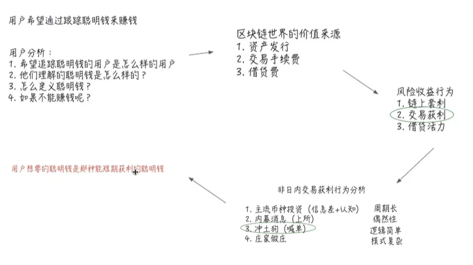

**Ⅰ-- 以太坊**
# Ⅰ、在以太坊和 Solidity 中，默认的全局变量、状态变量或特殊属性
由以太坊虚拟机（EVM）或 Solidity 语言自动提供，无需显式声明即可直接使用。

## 一、Solidity 全局变量（直接可用）
这些是 Solidity 内置的全局变量，主要用于获取区块链上下文信息或常用操作：

**1. 区块和交易信息**
变量名	       类型	                说明
block.number	  uint	     当前区块的编号（最新区块高度）。
block.timestamp	  uint	   当前区块的时间戳（秒级，由矿工设置，不完全可靠）。
block.coinbase	  address	 当前区块的矿工地址（打包该区块的矿工收益地址）。
block.difficulty	  uint	当前区块的难度值（PoW 链适用，如以太坊主网合并前）。
block.gaslimit	  uint	  当前区块的 Gas 上限。
block.chainid	  uint	    当前链的 ID（如以太坊主网为 1，Goerli 为 5）。
msg.sender	  address	    当前调用者的地址（可能是 EOA 或合约，直接触发当前函数的账户）。
msg.value	  uint	        随交易发送的 ETH 金额（wei 单位），仅在 payable 函数中有效。
msg.data	  bytes	        完整的调用数据（calldata）。
msg.sig	   bytes4	        函数选择器（调用函数的前 4 字节，如 keccak256("foo()") 的前 4 字节）。
tx.origin	address	        原始交易发送者（EOA 地址），慎用（可能被钓鱼攻击）。
tx.gasprice	uint	        当前交易的 Gas 单价（单位：wei/gas）。

**2. 合约自身信息**
变量名	类型	说明
address(this)	address	当前合约的地址。
this	address	同 address(this)（不推荐使用，可能在未来版本弃用）。
type(C).name	string	合约 C 的名称（仅对合约类型有效）。

**3. 数学和哈希**
变量名	类型	说明
blockhash(uint blockNumber)	bytes32	返回指定区块号的哈希（仅对最近的 256 个区块有效）。
keccak256(bytes memory)	bytes32	计算 Keccak-256 哈希（常用于生成随机数或验证数据）。
sha256(bytes memory)	bytes32	计算 SHA-256 哈希。
ripemd160(bytes memory)	bytes20	计算 RIPEMD-160 哈希。

## 二、合约默认状态变量
合约账户在 EVM 层面还有一些隐式存储的属性（尽管 Solidity 中不直接暴露为变量）：

1.合约字节码
通过 address(code).code 获取（Solidity 0.8.0+ 支持）。
**示例：**
solidity
bytes memory contractCode = address(contractAddress).code;

2.合约存储槽（Storage Slots）
合约的状态变量按规则存储在固定的存储槽中，可通过内联汇编访问（如 sload/sstore）。
合约自毁状态
合约是否已被 selfdestruct 标记（无法通过 Solidity 直接读取，需通过 extcodesize 检查）。

## 三、EVM 底层变量（需内联汇编访问）
以下变量需要通过 Solidity 的 assembly 块访问：

变量名	说明
gasleft()	剩余 Gas（等同 Solidity 的 gasleft() 函数）。
caller()	调用者地址（类似 msg.sender，但在汇编中可能受 delegatecall 影响）。
callvalue()	随调用发送的 ETH 金额（类似 msg.value）。

示例：
function getRemainingGas() public view returns (uint256) {
    uint256 gas;
    assembly {
        gas := gasleft()
    }
    return gas;
}

## 二、以太坊区块链，哪些数据可以直接从区块中获取？
在以太坊的区块（block）里，你能直接、无需额外计算拿到的全部是原生字段，可分成四大类：
区块头字段、交易列表、叔块（Uncle）信息、以及交易收据（Receipt）。
下面按实际可读取到的粒度列出，并给出最常见的 JSON-RPC 调用接口，方便你写脚本时直接对号入座。

|类别|	可直接获取的字段（示例）	|对应 RPC 方法|
|----|----|----|
|区块头	（**Header**）|区块号、时间戳、矿工地址、GasLimit、GasUsed、区块奖励、难度、parentHash、stateRoot、transactionsRoot、receiptsRoot、logsBloom | 	eth_getBlockByNumber  eth_getBlockByHash |
|交易列表	（**Transactions**）|该区块内所有交易的完整对象：txHash、from、to、value、input/data、gasPrice、gasLimit、nonce、r/s/v 签名	|同上（full=true 参数）|
|叔块	（**Uncles**）|该区块引用的所有 Uncle 的哈希、矿工地址、奖励	|eth_getUncleByBlockHashAndIndex  eth_getUncleCountBy… |
|交易收据	（**Receipts**）——**事件日志**|每笔交易的 status（成功/失败）、实际 GasUsed、logs（事件日志）、合约地址（如果是创建交易）	|eth_getBlockReceipts 或 eth_getTransactionReceipt（逐条）|

1️⃣ 区块头（Header）——一次性拿到
// eth_getBlockByNumber("latest", false)
{
  "number": "0x129a857",        // 区块号
  "timestamp": "0x66c0a1af",    // 时间戳（秒）
  "miner": "0x952222...9D7A",   // 验证者/矿工地址
  "gasUsed": "0x1c9c380",
  "gasLimit": "0x1c9c380",
  "difficulty": "0x0",          // PoS 后固定 0
  "reward": "0x2b5e3af16b188", // 该区块的 baseFee + tips（单位 wei）
  ...
}
**注意：**区块奖励在 JSON-RPC 里不会直接出现，但可通过 reward = (baseFeePerGas * gasUsed) + (priorityFee * gasUsed) 即时算出。

2️⃣ 交易列表（Transactions）
把 full=true 打开就能一次性拿到该区块内所有交易对象，无需再逐个 eth_getTransactionByHash。

"transactions": [
  {
    "hash": "0xabcd...",
    "from": "0x111...",
    "to": "0x222...",
    "value": "0xde0b6b3a7640000", // 1 ETH
    "input": "0xa9059cbb...",     // 函数签名 + 参数
    "gasPrice": "0x3b9aca00",
    ...
  },
  ...
]

3️⃣ 收据（Receipts）——事件日志
收据里最重要的两件事：status（交易是否成功）和 logs（所有事件）。
单条：eth_getTransactionReceipt(txHash)
整批：eth_getBlockReceipts(blockNumber)（一次返回该区块全部收据，减少往返）

4️⃣ 叔块（Uncles）
PoS 之后叔块已极少出现，但字段仍保留。可通过
eth_getUncleCountByBlockNumber → eth_getUncleByBlockNumberAndIndex 拿到叔块哈希、矿工地址、奖励。
不能直接在区块里拿到、需要额外 RPC 的数据

|需求	|需额外调用的接口|
|----|----|
|账户余额|	eth_getBalance|
|合约字节码	|eth_getCode|
|合约 storage 变量值	|eth_getStorageAt|
|内部调用/状态变化	|debug_traceTransaction / trace_block（需节点开 debug API）|

**速查口诀**
区块头 + 交易 + 收据 + Uncle 4 类字段，用 eth_getBlock* + eth_getBlockReceipts 即可全量拉取。
余额、代码、storage、内部调用 不在区块里，需要额外 RPC。

**注意**： **原始的区块链数据无法聚合、排序、搜索、筛选**
——————————————————————————————————————————————

# Ⅱ、构建数据密集型应用
## 一、区块链的数据密集型应用
1. **定义**：依赖数据提供核心价值；
2. **特点**：
- 数据量
- 复杂度
- 快速多样化
3. **应用场景**：
- 搜索引擎
- 社交媒体平台
- 流媒体服务
- 其他等等。。。。。。

## 二、区块链数的特性和挑战
1. 优势：
- 透明，不可篡改
- 高价值：自主权的数据
  - 资产，身份，交易等；
- 高质量：有序，完整，唯一 
2.挑战：
- 存储持续增长
- 不是为了数据检索设计
- 结构化，但是无法解释 
3.解决了什么问题
 

## 三、如何设计区块链的数据密集型应用

左边固定场景，右边开放场景
- 应用举例：
**the  graph**：偏数据的实时索引；主要是自己编写发布的合约，要将合约的数据进行搜集和发布，就用这个。但他不能做数据探索。
**dune**：更全面和准确的数据，能够做数据探索。

- 资金追踪，大额交易预警系统的制作
- 数据挖掘路线
找到数据源；目标数据特征化；大额交易筛选；构建链上交易预警机器人；

行式存储，列式存储，图存储

## 四、Chainbase Platform Architecture

twitter：lxcong

# Ⅲ、数据产品分层

## Defillama
典型的数据应用
DeFiLlama 是一个免费、开源的 DeFi 数据仪表盘，帮你一站式追踪所有去中心化协议、链、交易所的 TVL、收益率、空投、资产储备等关键信息。

# Ⅳ、打造数据应用的步骤
1. 确认用户需求和产品边界；
2. 定义数据需求，进行数据挖掘；
3. 结合数据提供给用户价值；

## 实际数据应用举例

**用户希望通过跟踪聪明钱来赚钱？？？**

1.用户分析：
- 希望追踪聪明钱的用户是怎样的用户？
- 他们理解的聪明钱是怎么样的？
- 怎么定义聪明钱？
- 如果不能赚钱呢？

2. 区块链**三种价值来源**的方式，**散户是无法获取的**
- 资产发行----项目方；
- 交易手续费----交易所；
- 借贷费----巨鲸；

3. **风险收益**行为：
- 链上套利
- 交易获利
- 借贷活动
以上三种方式，只有‘**交易获利**’是**散户可以赚取的收益**

4. 非日内交易获利行为：
- 主流币种投资（信息差+认知）；----周期长
- 内幕消息（上所）；          ---- 偶然性，数据分析抓不到
- 冲土狗（喊单）；            ---- 逻辑简单，一些KOL喊单推动，没有内在价值，但容易被数据分析挖掘
- 庄家坐庄                   ---- 模式复杂
  
**结论1：用户想要的聪明钱是那种短期获利的聪明钱**
**结论2：**跟踪聪明钱的思路是错误，无法长久，偶然和不受控的，大概率是赚不到钱的

# Ⅴ、如何进行数据挖掘
- 做过数据分析或者数据挖掘的朋友都知道，**越是有价值的问题越没有准确答案**。
- 比如一个很简单的问题，某个区块上有多少笔交易?很多人直觉可能就会直接count那个区块的transaction。
- 但是呢，有没有人想过，什么是交易?如果把交易理解成以太坊上的transaction，也还会有歧义，合约间互相调用算么?
- 如果再广义一些，问这个问题的人其实是想知道用户行为，那么很多transaction背后都代表了多个用户行为。
- 其实是没有准确答案的，因为问题里的很多词语是没有精准定义的。
所以我们在进行**数据挖掘的时候就需要抱着开放的心态**，在时间和条件允许的情况下探索更多可能性。

## 如何挖掘出聪明钱，首先我们可以有几个思路
- 在一段时间内，在一个币种上卖出平均价格高于买入的价格。
- 找到最近拉盘的土狗币的早期购买者。
- 寻找那些土狗币拉盘前夕买入的地址。
- 找到那些土狗币早期的流动性质押者，他们可能是庄家。

## 数据源网站
-  dextools.io                   汇集了短期在dex里，最新最热的币种
-  

# Ⅵ、 区块链数据的金银铜
- **抽象数据**：lend_tvls，wallet_assets，dex_pools ，nft_trades，dex_swaps
- **解析数据**：nft_transfers，event_decodes，token_meta，nft_balance，nft_meta，
token_balance，token_transfer，nattive_balances
- **原始数据**：logs，traces，transactions，blocks

先找到原始数据，然后进行解析和抽象

举例：寻找聪明钱的sql
With
prices as(
  SELECT 
      toStartOfMinute(timestamp) as time,price 
  FROM
      prices.token_prices
  WHERE
      contract_ address ='0x1f9840a85d5af5bf1d1762f925bdaddc4201f984' 
      AND timestamp >='2022-09-01'
),
start price as(
    select
        price
     from
        prices
     order by
         time
     limit 1 ),

# Ⅶ、数据分析带来的认知提升，才是最大的收获
## 交易赚的是什么钱
1.**市场错误**:短线的波动、中短线市场情绪、长线认知错判；
2.**借贷**:中长线投资本质是带风险的借贷；
3.**交易手续费**:uniswap流动性质押加对冲、交易所补贴；
4.**市场整体alpha**: hold；

## chainbase的webhook

