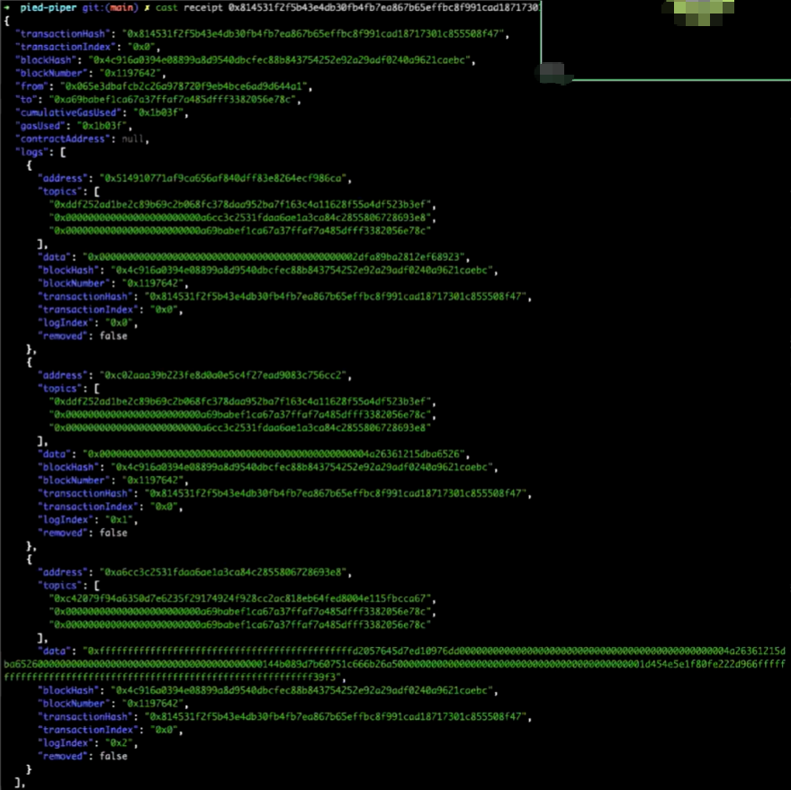

**如何利用实时信号，在链上进行跟单交易？**
# 一、前置概念
- 实时信号：实时信号是指在交易过程中，能够即时获取市场行情、价格波动等信息的能力。

# 实时交易数据/信号的获取
## 数据和信号包括哪些？
-  Transfer  **转账** (index _topic_1 address from, index_ topic_ 2 address to, uint256 value)
- Swap  **市场交易** (index_topic_1 address sender, uint256 amount0In, uint256 amountlIn, uint256 amount0Out, uint256 amount10ut, index_topic_2 address to)
- Withdrawal **提取** (index topic_l address src, uint256 wad)自定义信号等
- **自定义信号等**

## 如何获取触发信号？
**- 方式一：周期调用RPC**

- 需要解析raw data；
- 需要靠考虑reorg；
- 节点稳定性；
- 难以保证消息实时性；
周期性的去区块链上拿原始数据，然后进行解析，对于**一般的应用开发者**，**是不适用的**。

**旧的有问题的命令，当作参考，不可以使用**
anvil  --fork-url 
https://ethereum-mainnet.s.chainbase.online/v1/demo --fork-block-number 18445890

- **方式二：API调用**

- **方式三：使用开箱即用的kafka**
秒级别数据新鲜度；简单易用；数据易读；
- 消息队列；
- 支持消息重放；
- 高吞吐率；

## 如何进行链上交互
？？？ 
视频讲了chainbase的如何使用kafka去做链上交互，没太听明白，现在chainbase也不支持免费用户使用kafka了
先放一放，我个人理解就是：把一些chainbase现有数据集中的相关字段提取出来，以一种监控链上行为的方式，来触发。

# 二、实时数据建模DeFi Protfolio

